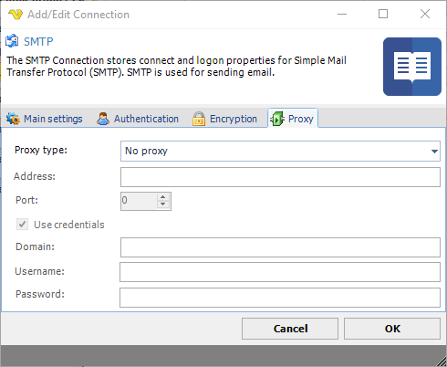

## Connection - SMTP

The SMTP Connection stores connect and logon properties for Simple Mail Transfer Protocol (SMTP). SMTP is used for sending email.
 
### About SMTP

Simple Mail Transfer Protocol (SMTP) is an Internet standard for electronic mail (e-mail) transmission across Internet Protocol (IP) networks. SMTP was first defined by RFC 821 (1982, eventually declared STD 10), and last updated by RFC 5321 (2008) which includes the Extended SMTP (ESMTP) additions, and is the protocol in widespread use today. It is an Application Layer protocol in the OSI reference model.
 
SMTP uses TCP port 25. The protocol for new submissions (MSA) is effectively the same as SMTP, but it uses port 587 instead. SMTP connections secured by SSL are known by the shorthand SMTPS on TCP port 465, though SMTPS is not a protocol in its own right.
 
While electronic mail servers and other mail transfer agents use SMTP to send and receive mail messages, user-level client mail applications typically use SMTP only for sending messages to a mail server for relaying. For receiving messages, client applications usually use either the Post Office Protocol (POP) or the Internet Message Access Protocol (IMAP) or a proprietary system (such as Microsoft Exchange or Lotus Notes/Domino) to access their mail box accounts on a mail server.
 
**Manage Connections > Add > SMTP > Main settings** tab

**Test**

It is possible to test the connection once you have set all settings. Click the Test button to start the test.
 
**Name**

The unique name for the Connection.
 
**Address**

The DNS name or IP address of the SMTP server.
 
**Port**

The port used by the SMTP server. Please note that it should match the port of the encryption. Normally encrypted connections uses port 465 or 587 while SMTP servers with no encryption uses port 25.
 
**Timeout**

The connection timeout in seconds. Connection will fail after this time is passed.
 
**Code page**

The table of values that describes the desired character set. Currently this is overridden by the code page in the Task.
 
### Default settings for some servers:

**Exchange**

Main settings
* Address: yourservername
* Port: 587
 
Encryption
* Cryptographic protocol: TLS
* Security Mode: Implicit
 
**Office 365 (Deprecated after April 2026 by [Microsoft](https://techcommunity.microsoft.com/blog/exchange/exchange-online-to-retire-basic-auth-for-client-submission-smtp-auth/4114750))**

Main settings
* Address: smtp.office365.com
* Port: 587
 
Encryption
* Cryptographic protocol: TLS (1.2)
* Security Mode: Explicit
 
**Gmail**

Main settings
* Address: smtp.gmail.com
* Port: 465
 
Encryption
* Cryptographic protocol: TLS
* Security Mode: Implicit
 
**Amazon SES**
* Address: email-smtp.us-east-1.amazonaws.com OR your regionial Amazon SES address
* Port: 465
 
Encryption
* Cryptographic Protocol: TLS (1.2)
* Security Mode: Implicit
 
**Manage Connections > Add > SMTP > Authentication** tab

**Anonymous**

Check this if you want to logon without providing user name and password.
 
**Username**

The user name for the email account.
 
**Password**

The password for the email account.
 
**Manage Connections > Add > SMTP > Encryption** tab

**Cryptographic protocol**

Encryption protocol to use; No encryption, SSL or TLS.
 
**Security mode**

Explicit or Implict encryption.
 
**Allowed SSL/TLS versions**

Some SMTP servers require certain versions of SSL/TLS. Check the versions that are allowed. Sometimes it is necessary to specify the specific allowed version.
 
**Manage Connections > Add > SMTP > Proxy** tab

**Proxy type**

Select the proxy type to be used.
 
**Address**

The host name or IP address of the proxy server.
 
**Port**

The port of the proxy server.
 
**Use credentials**

Text ...
 
**Domain**

The name of the domain to be created.
 
**Username**

The user name to access the proxy server.
 
**Password**

The password to access the proxy server.
  
### Troubleshooting
 
**No authentication method enabled from those supported by the server**

Try checking _Anonymous_ checkbox.
 
**Error 96260 when sending email or clicking Test email**

Use full DNS name or IP instead of just "_servername_".
 
**User authentication failed: Unaccepted server reply for command AUTH PLAIN (_Gmail_)**

You need to allow less secure apps to access your Gmail account
Google may block sign-in attempts from some apps or devices that do not use modern security standards. Since these apps and devices are easier to break into, blocking them helps keep your account safe.
 
To disable this security feature:
 
* Sign in to Gmail
* Click here to access Less Secure App Access in My Account.
* Next to “Allow less secure apps: OFF,” select the toggle switch to turn ON.
 
This setting may not be available for:
 
Accounts with 2-Step Verification enabled: Such accounts require an application-specific password for less secure apps access.

G Suite users: This setting is hidden if your administrator has locked less secure app account access.

[https://myaccount.google.com/lesssecureapps](https://myaccount.google.com/lesssecureapps)