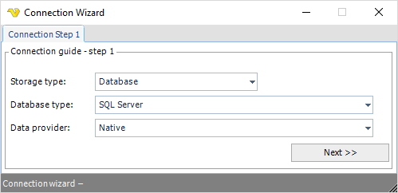
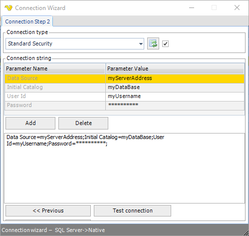
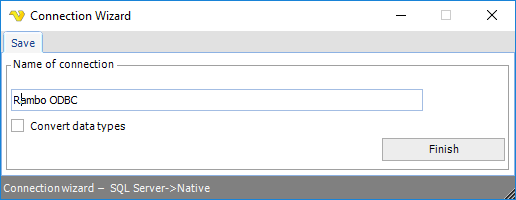
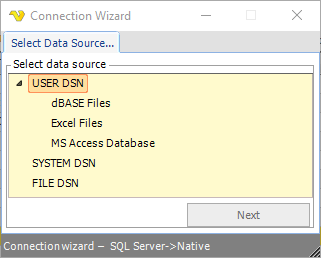
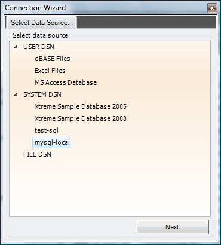
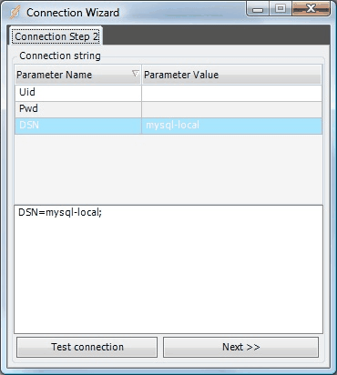
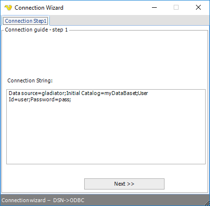
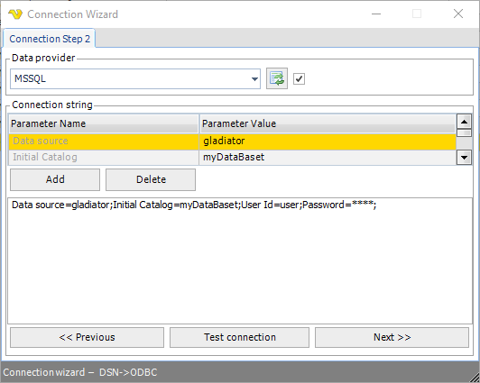
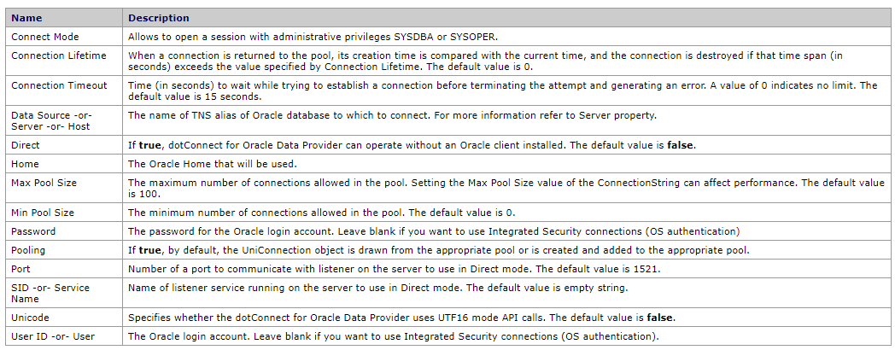
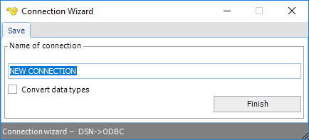

## Connection - SQL

The SQL Connection stores database connection properties for use in the [Database - SQL](../../client-user-interface/server/job-tasks/database-tasks/sql) Task and the [Event trigger - SQL](event-trigger-sql) Trigger.

The SQL Connection is configured through a wizard with three starting options:

**Manage Connections > Add > SQL > Wizard**

**Use connection guide**

Starts a guided wizard that builds the connection string based on your database type and provider. Recommended for new connections.
 
**Use existing data source**

Lets you select from existing ODBC data sources listed under System DSN.
 
**Use existing connection string**

Lets you enter a connection string directly if you already have one.

---

### Use connection guide
 
**Manage Connections > Add > SQL > Guide 1 - Step 1**

**Storage type**

The type of data storage to connect to. Available options:

* _Database_ - a standard relational database (most common)
* _File_ - a file-based data source such as Excel or Access
* _Other_ - other data source types
 
**Database type**

The specific database system to connect to. Supported types include: MSSQL, Oracle, MySQL, Snowflake, IBM DB2, PostgreSQL, SQLite, Sybase, Informix, Interbase, Firebird, Teradata, AS400, Amazon Aurora, Excel, Access, and many others.
 
**Data provider**

The driver or library used to connect to the database. Available options:

* _ODBC_ - connect via ODBC driver; works with most database types
* _OLEDB_ - connect via OLE DB provider; works with most database types
* _Native MSSQL_ - direct connection to Microsoft SQL Server (faster than ODBC/OLEDB)
* _Native MySQL_ - direct connection to MySQL
* _Native Oracle_ - direct connection to Oracle
* _Native DB2_ - direct connection to IBM DB2
* _Native PostgreSQL_ - direct connection to PostgreSQL

A direct (native) connection is faster than using ODBC or OLEDB.

**Allowed SSL/TLS versions**

Select which SSL/TLS protocol versions are permitted for this connection:

* _SSL version 3_
* _TLS version 1_
* _TLS version 1.1_
* _TLS version 1.2_
* _TLS version 1.3_

**Manage Connections > Add > SQL > Guide 1 - Step 2**

Select a connection type from the _Connection type_ list. The connection string grid is populated with the relevant parameters for the selected type. Edit the parameter values (server, username, password, database, etc.) as needed. The connection string is updated in real time as parameters are edited. Click the _Refresh_ icon to reload the parameters. Click _Test connection_ to verify the connection before saving.

:::tip Note

To use a trusted (Windows) connection, you may also need to select a Credential in the SQL Task. When testing the connection now, it runs as the currently logged-in user. When the SQL Task executes on a schedule it normally runs as SYSTEM, so a Credential may be required at the Task level.

:::
 
**Manage Connections > Add > SQL > Guide 1 - Step 3**

Enter a name for the Connection and optionally assign it to a group.
 
**Convert data types**

When checked and using stored procedures with OLEDB or ODBC, VisualCron will attempt to convert values to their specified data types. This is generally only needed for certain databases such as Sybase or SAP.

---

### Use existing data source
 
**Manage Connections > Add > SQL > Guide 2 - Step 1**

Select the System DSN you want to use. Only System DSN entries are shown — User DSN entries are not available across users and cannot be used by VisualCron.
 
**Manage Connections > Add > SQL > Guide 2 - Step 2**

Edit the DSN parameters if needed before saving.

---

### Use existing connection string
 
**Manage Connections > Add > SQL > Guide 3 - Step 1**

Enter the connection string.
 
**Manage Connections > Add > SQL > Guide 3 - Step 2**

Select the data provider (ODBC, OLEDB, Native MSSQL, Native MySQL, Native Oracle, etc.). For Oracle, the following connection string parameters are available:

 
**Manage Connections > Add > SQL > Guide 3 - Step 3**

Enter the name of the Connection.
 
**Convert data types**

When checked and using stored procedures with OLEDB or ODBC, VisualCron will attempt to convert values to their specified data types. This is generally only needed for certain databases such as Sybase or SAP.

---
 
### Troubleshooting

**Error ORA-12514 when using Oracle Direct mode in Task**

Make sure you are not using both SID and Service Name in the connection string. These cannot be used together — remove one of them.

**Error ORA-28009 and "Keyword not supported: dba privilege"**

Try using the `Connect Mode` parameter instead of `DBA Privilege`. For example: `Connect Mode=SYSDBA`
