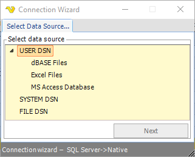

## Connection - SQL

The SQL Connection is used in the [Database - SQL](../../client-user-interface/server/job-tasks/database-tasks/sql) Task and the [Event trigger - SQL](event-trigger-sql) Trigger.
 
**Use Connection guide** wizard
 
**Manage Connections > Add > SQL > Wizard**

**Use connection guide**

This starts the wizard which suggests connection strings depending on database and connection type.
 
**Use existing data source**

This option lets you choose from existing ODBC data sources within the System DSN.
 
**Use existing connection string**

This lets you specify a plain connection string - if you have one from before.
 
**Manage Connections > Add > SQL > Guide 1 - Step 1**

**Storage type**

Normally a database, but you can also use file and other.
 
**Database type**

Select if it is an Oracle, MySQL, MSSQL or other database type.
 
**Data provider**

Different data providers exist for different database types. For Oracle, MySQL and MSSQL VisualCron provides direct connection and ODBC/OLEDB. For other database types you have to use either ODBC or OLEDB. A direct connection is faster than using ODBC or OLEDB.
 
**Manage Connections > Add > SQL > Guide 1 - Step 2**

In step 2 you select the connection type. In the _Connection type_ select box there is a list of predefined connection strings. Choose the appropriate one and the connection string grid will be filled with connection parameters. Edit the parameter value to set username, password etc. The connection string is update in realtime in the connection string text box. Click the _Refresh_ icon to refresh the parameters. When you are done you can test the connection by clicking on _Test connection_.
 
:::tip Note 

To use trusted connection you may have to select a Credential in your final SQL Task. If you connect now you are using the user you are logged in as. When the actual SQL Task is being run it is normally run as SYSTEM. That is why you may need a Credential at a later stage - in the SQL Task.

:::
 
**Manage Connections > Add > SQL > Guide 1 - Step 3**

At step 3 you save the actual connection by giving it a name.
 
**Convert data types**

When checked and using Stored procedures in combination with OLEDB/ODBC, VisualCron will try to, convert values to their specified format. Normally this is only needed and should only be used for certain databases like SYBASE/SAP.
 
**Use existing data source** wizard
 
**Manage Connections > Add > SQL > Guide 2 - Step 1**

Please select the System DSN you want to use.
 
**Manage Connections > Add > SQL > Guide 2 - Step 2**

Edit DSN parameters if needed.
 
**Use existing connection string** wizard
 
**Manage Connections > Add > SQL > Guide 3 - Step 1**

Enter the connection string.
 
**Manage Connections > Add > SQL > Guide 3 - Step 2**

The following parameters can be used for Oracle:

Choose the data provider (ODBC, OLEDB, MSSQL, MySQL, Oracle).
 
**Manage Connections > Add > SQL > Guide 3 - Step 3**

Enter the name of the Connection.
 
**Convert data types**

Text ...
 
### Troubleshooting

**Error ORA12514 when using Oracle Direct mode in Task**

Make sure you are not using both SID and Service name in the Connection string. Delete one of them if you do as the must not be used together.
 
**Error ORA-28009 and "Keydowrd not supported: dba privilege"**

Try using "Connect Mode" parameter instead of "DBA Privilege". For example: Connect Mode=SYSDBA