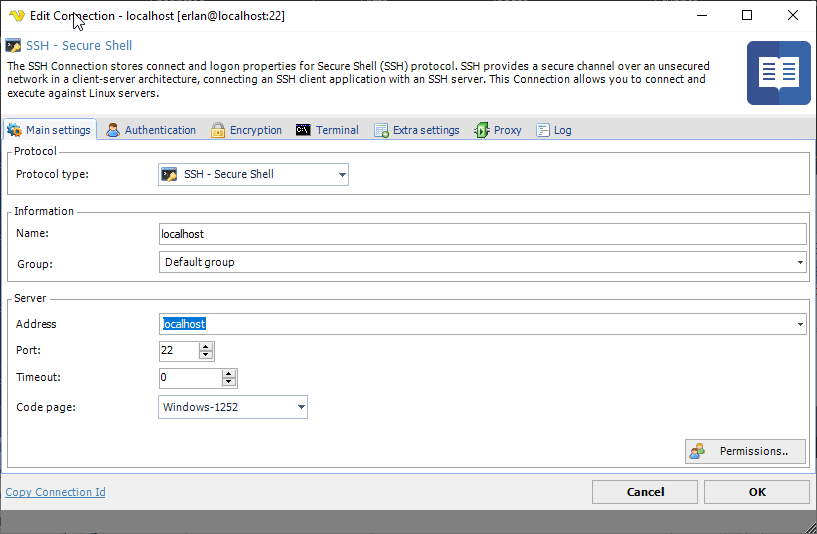
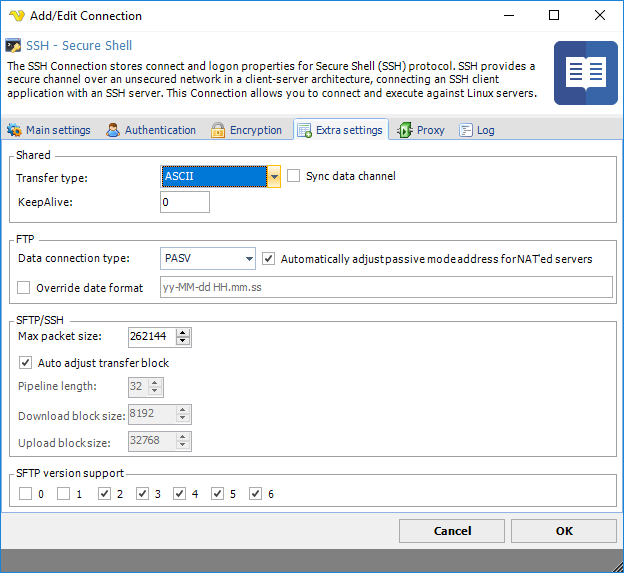

## Connection - SCP

The SSH Connection stores connect and logon properties for the Secure Shell (SSH) protocol. SSH provides a secure channel over an unsecured network in a client-server architecture, connecting a SSH client application with a SSH server. This connection allows you to connect and execute commands against Linux servers.
 
### About SSH

Secure Shell (SSH) is a cryptographic network protocol for secure data communication, remote command-line login, remote command execution, and other secure network services between two networked computers that connects, via a secure channel over an insecure network, a server and a client (running SSH server and SSH client programs, respectively). The protocol specification distinguishes between two major versions that are referred to as SSH-1 and SSH-2.
 
The best-known application of the protocol is for access to shell accounts on Unix-like operating systems, but it can also be used in a similar fashion for accounts on Windows. It was designed as a replacement for Telnet and other insecure remote shell protocols such as the Berkeley rsh and rexec protocols, which send information, notably passwords, in plain text, rendering them susceptible to interception and disclosure using packet analysis. The encryption used by SSH is intended to provide confidentiality and integrity of data over an unsecured network, such as the Internet.

**Manage Connections > Add > SSH - Secure Shell >Main settings** tab

**Timeout**

The timeout setting in the SSH Connection refers to the max time the full connection is opened. Using a too low value may abort the command prematurely. Default is 0 which is infinite timeout which means it will finish when the command finishes (Command timeout in the Task).

**Manage Connections > Add > SSH - Secure Shell > Extra settings** tab

**Transfer type**

[FTP](connection-ftp)/[SFTP](connection-sftp) only.
 
**Data connection type**

[FTP](connection-ftp) only option.
 
**Max packet size**

Use this property to specify the maximal length of packet in bytes. The default value is 262144, i.e., 256 KBytes.
 
**Auto adjust transfer block**

Use this property to enable or disable automatic adjustment of pipeline length and block sizes. By default automatic adjustment is enabled, and normally you don't need to disable it.
 
**Pipeline length**

Use this property to specify the number of upload or download requests sent before waiting for all requests to complete. The more requests are sent, the faster the transfer is. However, in case of error, all requests are discarded. Also, more pending requests means more memory used, so if speed is not critical and memory consumption is, set Pipeline Length to 1. Default value is 10.
 
**Download block size**

Use this property to control the size of the single download request. The servers don't limit download request size, however the buffer is allocated to store the requests, so the larger the value is, the memory block is needed.
 
**SFTP version support**

[SFTP](connection-sftp) only.
 
### Troubleshooting

**Other error codes**

[https://www.eldos.com/documentation/sbb/documentation/ref_err_ssherrorcodes.html](https://www.eldos.com/documentation/sbb/documentation/ref_err_ssherrorcodes.html)