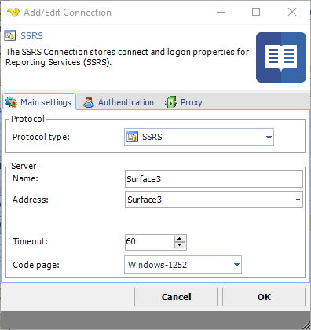

## Connection - SSRS

The SSRS Connection stores connect and logon properties for the Reporting Services (SSRS).
 
The SSRS Connection is used in the [Database - SSRS](databasessrs) Task. The Task is used to execute reports through SQL Server Reporting Services (SSRS).
 
Manage Connections > Add > SSRS > Main settings tab

**Name**

The unique name for the Connection.
 
**Address**

The IP or DNS name to the SSRS server. Do not use http prefix or full folder address.
 
**Timeout**

The connection timeout in seconds. Connection will fail after this time is passed.
 
**Code page**

The table of values that describes the desired character set.
 
**Manage Connections > Add > SSRS > Authentication** tab

**Username**

Username for the SSRS server.
 
**Password**

Password for the SSRS server.