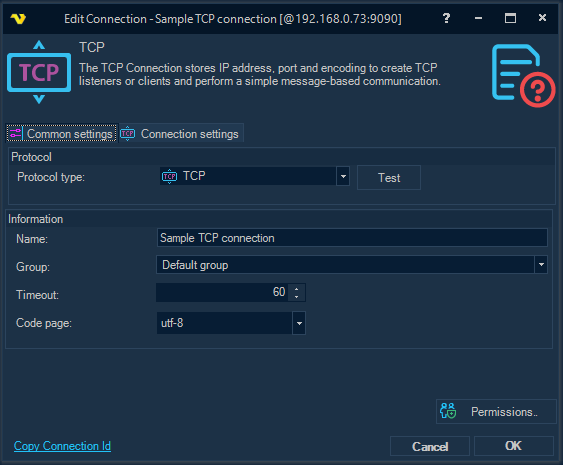
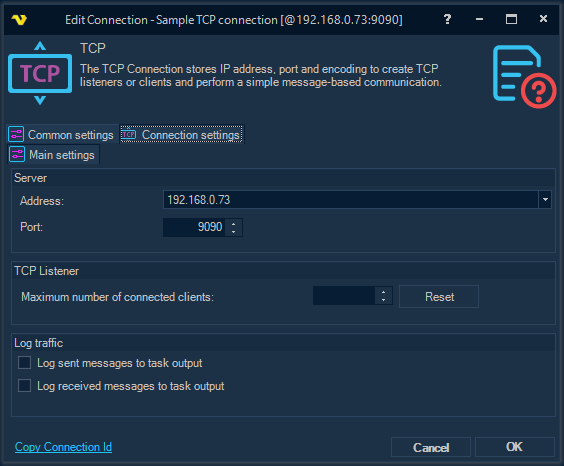

## Connection - TCP

The TCP Connection stores IP address, port and encoding to create TCP listeners or clients and perform a simple message-based communication.
 
### About TCP

The Transmission Control Protocol (TCP) is one of the main protocols of the Internet protocol suite. TCP provides reliable, ordered, and error-checked delivery of a stream of octets (bytes) between applications running on hosts communicating via an IP network.
TCP is connection-oriented, and a connection between client and server is established before data can be sent. The server must be listening (passive open) for connection requests from clients before a connection is established..
 
The TCP Connection is used in the [Net - TCP](../server/job-tasks/net-tasks/tcp) Task (which acts as a TCP client) and the [Event trigger - TCP](event-trigger-tcp) Trigger (which acts as a TCP server, or listener).
 
**Manage Connections > Add > TCP > Common settings** tab

**Name**

This is a descriptive name of the connection to distinguish from other connections.
 
**Timeout**

The amount of time, in seconds, a TCP client (both in the [Net - TCP](../server/job-tasks/net-tasks/tcp) Task and the [Event trigger - TCP](event-trigger-tcp) Trigger) will wait to receive data once a read operation is initiated.
 
**Code page**

Encoding of text messages sent by the TCP client to the TCP server and vice versa.
 
**Manage Connections > Add > TCP > Connection settings > Main settings** tab

**Address**

This is the host address to the server. A string that contains an IP address in dotted-quad notation for IPv4 and in colon-hexadecimal notation for IPv6. It can also be a DNS name for the TCP Task.
 
**Port**

For the TCP Task: the port number of the remote host. For the TCP Trigger: the port on which to listen for incoming connection attempts.
 
**TCP Listener > Maximum number of connected clients**

Maximum number of simultaneously connected TCP network clients allowed (0 or empty value - unbounded).
 
**Log sent messages to task output**

All messages sent from VisualCron to the remote TCP server are logged and stored in the Task output.
 
**Log received messages to Task output**

All messages received by VisualCron from the remote TCP server are logged and stored in the Task output.