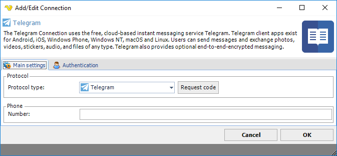
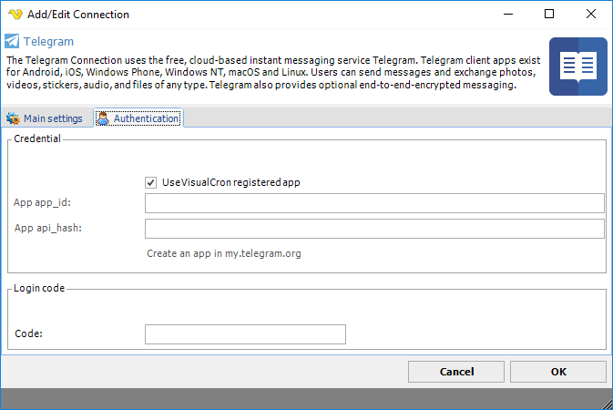

## Connection - Telegram

The Telegram Connection uses the free, cloud-based instant messaging service Telegram. Telegram client apps exist for Android, iOS, Windows Phone, Windows NT, macOS and Linux. Users can send messages and exchange photos, videos, stickers, audio and files of any type. Telegram also provides optional end-to-end encrypted messaging.
 
The Telegram Connection is used in the following Task:

* [Telegram - User Send message](../../client-user-interface/server/job-tasks/messaging-tasks/telegram-user-send-message)
 
### Setting up a Telegram application

In VisualCron you have the option, in the authentication tab, to use the existing Telegram app "VisualCron". If you for some reason, want to use your own app, you need to create one [here](https://my.telegram.org/auth?to=apps) and then enter *App app_id* and *App api_hash* in authentication tab.
 
Once you have created your app or selected to use the default one for VisualCron you enter your *phone* number and click on *Request code*. Use the code you obtain in your Telegram Client in VisualCron *Code* field.
 
**Manage Connections > Add > Telegram > Main settings** tab

**Request code**

Click this to receive a code to authorize VisualCron for sending messages. You need to enter *Phone* number for this to work.
 
**Phone**

Enter phone number including country code, i.e. +1888555222.
 
**Manage Connections > Add > Telegram > Authentication** tab

**Use VisualCron registered app**

See setup in top of documentation. Check this if you want to use the default VisualCron app.
 
**App app_id**

If you want to use your own app then copy this information from the settings of the app online.
 
**App api_hash**

If you want to use your own app then copy this information from settings of the app online.
 
**Code**

Once you have clicked Request code in main settings tab you will receive a code in your Telegram Client. Paste this here.