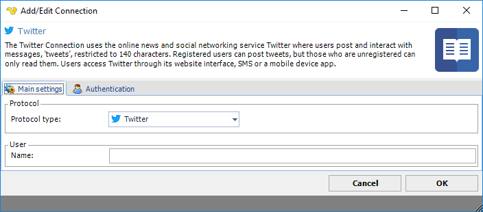
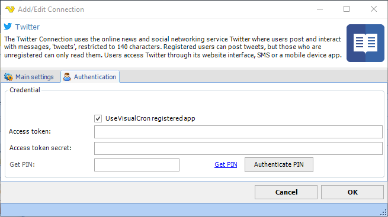
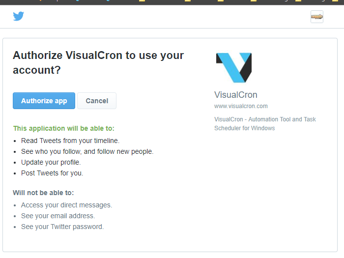
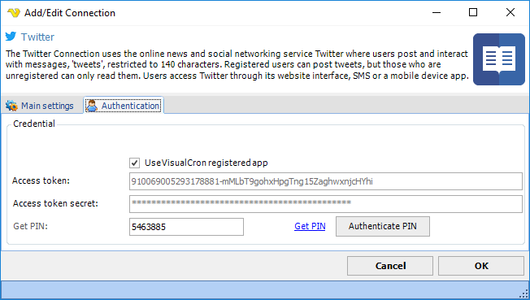
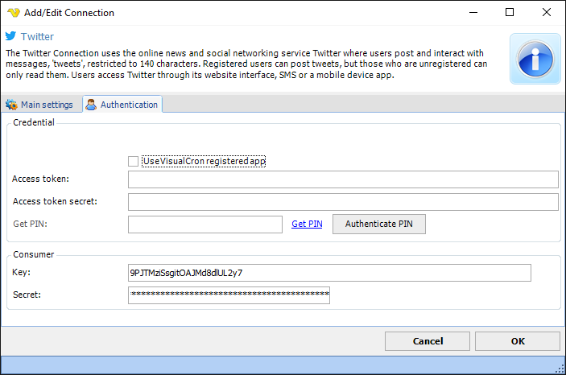

## Connection - Twitter

The Twitter connection uses the online news and networking service Twitter where users post and interact with messages, "tweets", restricted to 40 characters. Registered users can post tweets, but those who are unregistered can only read them. Users access Twitter through its website interface, SMS or a mobile device app.
 
The Twitter Connection is used in the Twitter Tasks.
 
**Manage Connections > Add > Twitter > Main settings** tab

**Name**

This field will be filled by VisualCron once the PIN has been authenticated.
 
**Manage Connections > Add > Twitter > Authentication** tab

**Use VisualCron registered app**

When creating a Twitter Connection you have the option to use the registered VisualCron Twitter app or user your own app. If you have your own app you need to fill Consumer Key and Consumer Secret from Twitter web page - Application settings.
 
**Get PIN**

Click on Get PIN to start authorization against the VisualCron app or your own app.
 
### Authorization of VisualCron to perform Twitter Tasks

To create a Connection you first need to authorize VisualCron to perform Twitter Tasks. This is done by retrieving a PIN through a Consumer key and Secret.
 
**Use the VisualCron app**

1. Click on Get PIN button in VisualCron.
2. Authorize the VisualCron app in the Twitter web page and you will receive a PIN.  
3. Paste the PIN in the Get PIN field and click on Authenticate PIN.
 
**Use your own app**

If you want to use your own app (e.g. if you/your company already have an app or if you need special permissions) you need to:
1. Create your on app in Twitter if you have not done that
2. Uncheck Use VisualCron app registered app in Authentication page
3. Fill in the Consumer key and the Consumer secret from Twitter web page.
4. Click on Get PIN button in VisualCron.
5. Authorize VisualCron in the web page and you will receive a PIN.  
6. Paste the PIN in VisualCron and click on Authenticate PIN.
 
**Authorize the VisualCron app in browser**

**Authorize the VisualCron app in browser - Access granted - PIN received**

**Authorize use your own app in browser - Access granted - PIN received**

**Use VisualCron registered app**

When creating a Twitter Connection you have the option to use the registered VisualCron Twitter app or user your own app. If you have your own app you need to fill *Consumer Key* and *Consumer Secret* from Twitter web page - Application settings.
 
**Access token**

Access token is retrieved and filled once you have authorized the app.
 
**Access secret**

Access secret is retrieved and filled once you have authorized the app.
 
**PIN**

After pressing Get PIN and you have authorized the app you need to copy/paste the PIN here. Then press *Authenticate PIN*.
 
**Authenticate PIN**

Click this button once you have retrieved and filled a *PIN* in the *PIN field* (after authorization).