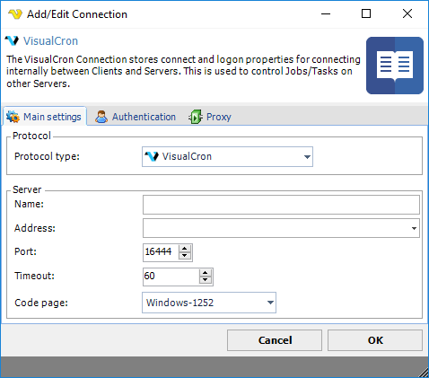
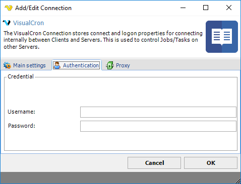
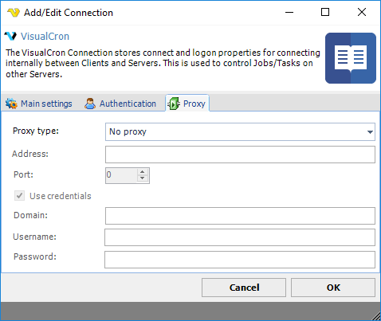

## Connection - VisualCron

The VisualCron Connection stores connect and logon properties for connecting internally between Clients and Servers. This is used to control Jobs/Tasks on other servers.
 
The VisualCron Connection is used in the [Internal - Job/Task control](../../client-user-interface/server/job-tasks/internal-tasks/control) Task and the [Event trigger - VisualCron](event-trigger-visualcron) Trigger. The Connection is used to connect to a local or remote VisualCron Server instance.
 
**Manage Connections > Add > VisualCron > Main settings** tab

**Name**

The unique name for the Connection.
 
**Address**

The DNS name or IP of the VisualCron server.
 
**Port**

The port used by VisualCron - default 16444.
 
**Timeout**

The connection timeout in seconds. Connection will fail after this time period.
 
**Code page**

Not used.
 
**Manage Connections > Add > VisualCron > Authentication** tab

**Username**

The username for the user in the VisualCron Server.
 
**Password**

The password for the user in the VisualCron Server.
 
**Manage Connections > Add > VisualCron > Proxy** tab

**Proxy type**

The FTP implementation supports the HTTP proxy type and the SFTP implementation supports the SOCKS4 and SOCKS5 proxy types.
 
**Address**

Host name or IP number of the proxy server.
 
**Port**

Port of the proxy server.
 
**Use credentials**

Text ...
 
**Username**

A username to access the proxy server.
 
**Password**

A password to access the proxy server.