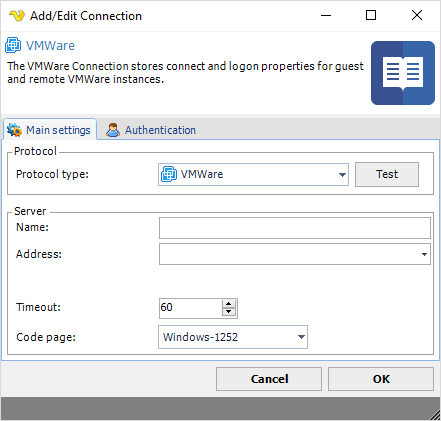
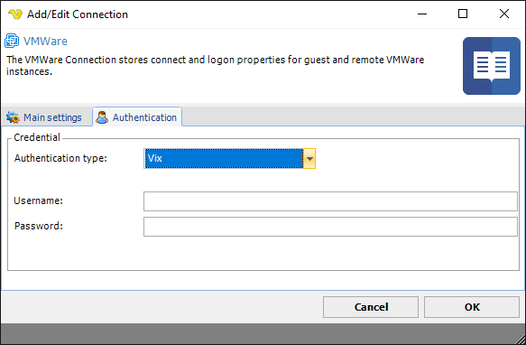

## Connection - VMWare

The VMWare Connection stores connect and logon properties for guest and remote VMWare instances.
 
The VMWare Connection is used for connecting to remote VMWare instances in the following Tasks:

* [VMWare - Start VM](vmwarestartvm)
* [VMWare - Stop VM](vmwarestopvm)
* [VMWare - Suspend VM](vmwaresuspendvm)
* [VMWare - Pause VM](vmwarepausevm)
* [VMWare - Resume VM](vmwareresumevm)
* [VMWare - Reset VM](vmwaresetvm)
* [VMWare - Get VM status](vmwaregetvmstatus)
* [VMWare - Create VM snapshot](vmwarecreatevmsnapshot)
* [VMWare - Revert to VM snapshot](vmwarereverttovmsnapshot)
* [VMWare - Delete VM snapshot](vmwaredeletevmsnapshot)
* [VMWare - List VM snapshots](vmwarelistvmsnapshots)
* [VMWare - Delete VM](vmwaredeletevm)
* [VMWare - Clone VM](vmwareclonevm)
* [VMWare - Install tools](vmwareinstalltools)
* [VMWare - Register VM](vmwareregistervm)
* [VMWare - Unregister VM](vmwareunregistervm)
* [VMWare - List VM](vmwarelistvm)
* [VMWare - Capture screen (guest)](vmwarecapturescreenguest)
* [VMWare - Copy files (guest)](vmwarecopyfilesguest)
* [VMWare - Rename file (guest)](vmwarerenamefileguest)
* [VMWare - Delete files (guest)](vmwaredeletefilesguest)
* [VMWare - Directory exists (guest)](vmwaredirectoryexistsguest)
* [VMWare - File exists (guest)](vmwarefileexistsguest)
* [VMWare - Delete directory (guest)](vmwaredeletedirectoryguest)
* [VMWare - Create directory (guest)](vmwarecreatedirectoryguest)
* [VMWare - Create temp file (guest)](vmwarecreatetempfileguest)
* [VMWare - Run command (guest)](vmwareruncommandguest)
* [VMWare - Open URL (guest)](vmwareopenurlguest)
* [VMWare - Kill processes (guest)](vmwarekillprocessesguest)
* [VMWare - List processes (guest)](vmwarelistprocessesguest)
 
**Manage Connections > Add > VMWare > Main settings** tab

**Name**

The unique name for the Connection
 
**Address**

The address to the VMWare server.
 
**Timeout**

The connection timeout in seconds. Connection will fail after this time period.

**Code page**

Code page being used.
 
**Manage Connections > Add > VMWare > Authentication** tab

**Authentication type**

Choose between VIX or vSphere. VIX stands for the old API that uses COM libraries to manage vSphere. This is supported up to version 6.0 of vSphere. For future version the new vSphere API is used which is based on web services. The VMware vSphere® Web Services SDK includes all the components necessary to work with the VMware vSphere API, including WSDL files, sample code, and libraries. The vSphere Web Services SDK facilitates development of client applications that target the VMware vSphere API. With the vSphere Web Services SDK, developers can create client applications to manage, monitor, and maintain VMware vSphere components, as deployed on VMware® VMware vSphere® ESX®, ESXi™, and VMware® vCenter™ Server systems.
 
**Username**

The username for the server.
 
**Password**

The password for the server.
 
 
### Troubleshooting

*The protocol requested by peer '0 0 9 1' does not match expected '3 1 0 0'. Make sure both sides agree on protocol id and version.*
Please upgrade remote server to AMQP 1.0. VisualCron supports AMQP 1.0 or later.