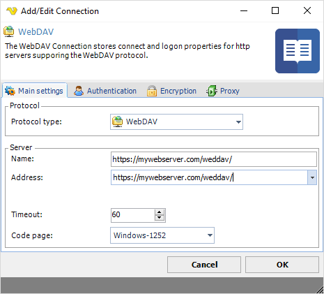
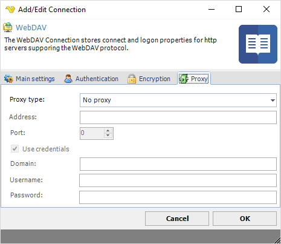

## Connection - WebDAV

The WebDAV Connection stores connect and logon properties for HTTP servers supporting the WebDAV protocol.
 
The WebDAV Connection is used by the following WebDAV Tasks:
* [Net - WebDAV - Download](netwebdavdownload)
* [Net - WebDAV - Upload](netwebdavupload)
* [Net - WebDAV - Copy files](netwebdavcopyfiles)
* [Net - WebDAV - Delete](netwebdavdelete)
* [Net - WebDAV - Create folder](netwebdavcreatefolder)
 
Web Distributed Authoring and Versioning (WebDAV) is an extension of the Hypertext Transfer Protocol (HTTP) that allows clients to perform remote Web content authoring operations. A working group of the Internet Engineering Task Force (IETF) defined WebDAV in RFC 4918.
 
The WebDAV protocol makes the Web a readable and writable medium.[1] It provides a framework for users to create, change and move documents on a server, typically a web server or web share. The most important features of the WebDAV protocol include the maintenance of properties about an author or modification date, namespace management, collections, and overwrite protection. Maintenance of properties includes such things as the creation, removal, and querying of file information. Namespace management deals with the ability to copy and move web pages within a server’s namespace. Collections deal with the creation, removal, and listing of various resources. Lastly, overwrite protection handles aspects related to locking of files.
 
**Manage Connections > Add > WebDAV > Main settings** tab

**Name**

The unique name for the Connection
 
**Address**

The DNS name or IP address of the server.
 
**Timeout**

The connection timeout in seconds. Connection will fail after this time is passed.
 
**Code page**

The table of values that describes the desired character set. Currently this is overridden by the code page in the Task.
 
**Manage Connections > Add WebDAV > Authentication** tab

**Authentication type**

Select authentication type required for server; Basic, Digest or NTLM (Windows authentication).
 
**Username**

The user name for the WebDAV account.
 
**Password**

The password for the WebDAV account.
 
**Manage Connections > Add > WebDAV > Encryption** tab

**Allowed SSL/TLS versions**

Some servers require certain versions of SSL/TLS. Check the versions that are allowed. Sometimes it is necessary to specify the specific allowed version.
 
**Manage Connections > Add > WebDAV > Proxy** tab

**Proxy type**

Select the proxy type to be used.
 
**Address**

The host name or IP address of the proxy server.
 
**Port**

The port of the proxy server.
 
**Use credentials**

Text ...
 
**Domain**

The name of the domain to be created.
 
**Username**

The user name to access the proxy server.
 
**Password**

The password to access the proxy server.