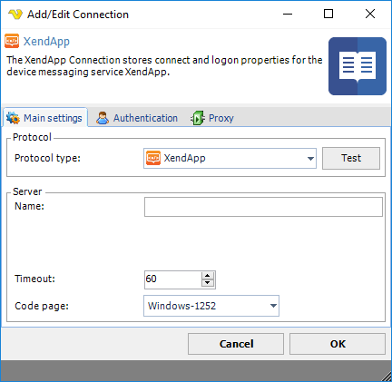
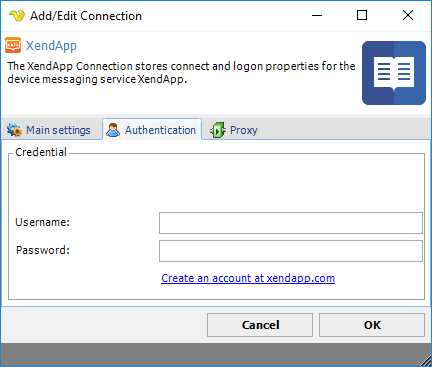

## Connection - XendApp

The XendApp Connection stores connect and logon properties for the device messaging service XendApp.
 
XendApp is a platform for delivering instant messages to any device (phone/tablet). It is a free service which uses notification services to deliver a message. Registration is done [here](https://xendapp.com/Register.aspx).
 
**Manage Connections > Add > XendApp > Main settings** tab

**Test**

It is possible to test the connection once you have set all settings. Click the Test button to start the test.
 
**Name**

The unique name for the Connection.
 
**Address**

This field is not used.
 
**Timeout**

The connection timeout in seconds. Connection will fail after this time period.
 
**Code page**

Code page being used.

**Manage Connections > Add > XendApp > Authentication** tab

**Username**

The username for the registered XendApp account. Register [here](https://xendapp.com/Register.aspx) for free.
 
**Password**

The password for the registered XendApp account. Register [here](https://xendapp.com/Register.aspx) for free.

