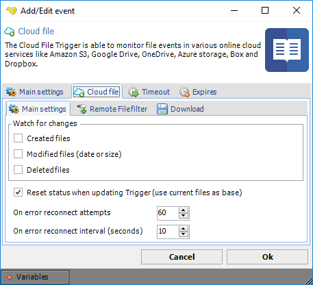
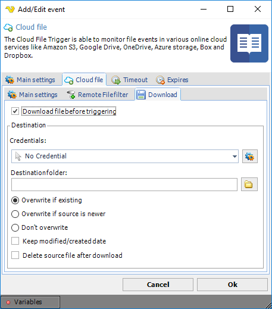

## Event Trigger- Cloud File

The Cloud file event trigger is able to monitor file events in various online cloud services:
* [Amazon S3](../server/connection-amazon)
* [Box](../server/connection-box)
* [DropBox](../server/connection-dropbox)
* [Google Drive](../server/connection-google-drive)
* [Microsoft Azure](../server/connection-microsoft-azure)
* [OneDrive](../server/connection-onedrive)
 
Different [Connections](../server/global-connections) are used depending on the wanted cloud service provider.
 
**Triggers > Add > Event Trigger > Cloud file > Cloud file > Main settings** tab

**Watch for changes**

You are able to watch for new, modified and deleted files. Select what you want the Trigger to fire for.
 
**Reset status when updating Trigger (_use current files as base_)**

This reloads the internal list of files. You should check this if you for some reason change the Connection.
 
**On error reconnect attempts**

Let say the remote server you watch gets disconnected for some reason, perhaps the network or computer is down. The reconnect attempts value controls how many times VisualCron tries to reconnect. Default value is 3 times.
 
**On error reconnect interval (_seconds_)**

Let say the remote server you watch gets disconnected for some reason, perhaps the network or computer is down. The reconnect interval which you can specify is the number of seconds it will wait between each reconnect attempt, in seconds. Value 1 to 500 is available. Default is 5 seconds which may be a long time when the network is down and a short time if the remote computer is down. VisualCron attempts to reconnect 3 times by default.
 
**Triggers > Add > Event Trigger > Cloud file > Cloud file > Remote file filter** tab

This Trigger uses the [Cloud Remote file filter](../server/job-tasks-cloud-remote-file-filter) for filtering out files to check for.
 
**Triggers > Add > Event Trigger > Cloud file > Cloud file > Download** tab

**Download file before triggering**

Optionally, you can set the Remote file Trigger to download the file that was just Triggered.
 
**Credential**

Select a [Credential](../server/global-credentials) if you are going to save to a network drive. Click the Settings icon to populate the drop-down list with available credentials.
 
**Destination folder**

The local folder where the file should be saved. Click the Folder icon in order to browse the folder tree.
 
**Overwrite options**

If the file exists you can choose different overwrite options.
 
**Keep modified/created date**

Sets the modified/created date on locally downloaded files to the same dates as the remote files.
 
**Delete source file after download**

Optionally delete the remote file after download.