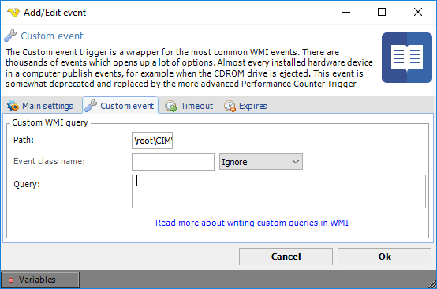

## Event Trigger - Custom

The Custom event trigger is a wrapper for the most common **WMI** events. There are thousands of events which opens up a lot of options. Almost every installed hardware device in a computer publish events, for example when the CDROM drive is ejected. This event is somewhat depreciated and replaced by the more advanced Performance Counter trigger.
 
Events that are not considered, may be taken care of by creation of your own WQL (WMI Query Language) query. VisualCron do not take any responsibility for customer created WQLs, however there is a lot of documentation available on the Internet.
 
When trying to find the right query for an event it's good to have a tool, e.g. the Microsoft WMI Code Creator. This tool let's you browse, test and construct your queries. The tool can be downloaded from [here](https://www.microsoft.com/en-us/download/details.aspx?id=8572).

**Path**

WMI supports namespaces, allowing users to logically group WMI classes together. Each WMI provider normally registers its own WMI namespace and then all its classes within that namespace. For example, all Win32 WMI classes can be found in the namespace "root\cimv2", all IIS WMI classes can be found at "root\microsoftiisv2", and all LDAP WMI classes can be found at "root\directory\ldap". The root namespace is called "Root" and namespaces can have child namespaces and WMI classes. The default path is \root\CIMV2.
 
**Event class name**

Some drivers require that you specify their class belonging. If necessary, this information can be retrieved from the WMI Code Create. Normally, the Event class name is the "table name" when constructing a query.
 
**Query**

This is the field where the query is entered. If you need to specify a polling interval you do that in the query using the operator WITHIN. 

:::tip Example

SELECT *

FROM __InstanceOperationEvent

WITHIN 10

WHERE

TargetInstance ISA 'Win32_Processor'

AND TargetInstance.LoadPercentage > 15

:::

This query checks if the CPU load is over 15%. WITHIN 10 means that it will check that every 10th second. Our recommendation is that you do not use a lower WITHIN value than 10, because this may keep your CPU too busy.
 
A new query in WMI Code Creator have to be tested before entering in VisualCron. Entering an invalid query may affect the VisualCron stability.
 
A few WMI links:
[Microsoft WMI Scripting Primer](https://www.microsoft.com/technet/scriptcenter/guide/sas_wmi_overview.mspx?mfr=true)
[WMI error codes](https://learn.microsoft.com/en-us/windows/win32/api/wbemdisp/ne-wbemdisp-wbemerrorenum?redirectedfrom=MSDN)