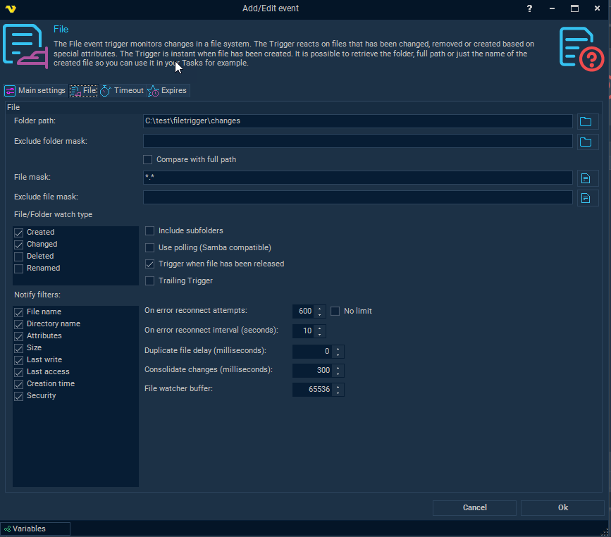

## Event Trigger - File

The File event trigger monitors changes in a file system. The Trigger reacts on files that has been changed, removed or created based on special attributes. The Trigger is instant when file has been created. It is possible to retrieve the folder, full path or just the name of the created file so you can use it in your Tasks for example.
 
To monitor a change you have to specify a path. The file event is not based on **WMI** but can monitor a remote computer if you specify the appropriate credentials (username, password and computer name for the remote computer).
 
**Triggers > Add > Event Trigger > File** tab



**Folder path**

This is the directory you want to monitor.
 
**File mask**

The filter can be a complete file name or your can use `*.*` to monitor all files (default) or e.g. `\*.txt` to monitors all text files. If you want to check for multiple file masks you can separate them with semicolon `(;)`. For example: `*.txt`; `*.xml`
 
**Exclude folder mask**

Use this field, with our without wild cards, to exclude triggering files from (sub)folder matching the mask. The comparison will be done against the sub folder name. If you do want to check against the whole part of the path then check *Compare with full path*.
 
**Compare with full path**

See above.
 
**Exclude file mask**

This field is used the same as File mask but is used to exclude one or more file masks. If you want to check for multiple file masks you can separate them with semicolon (;). For example: *.txt;*.xml. To exclude special characters like `#` you need to wrap them like this:
`[#]`. For example: `[#]*`.txt
 
**File/Folder watch type**

There are a set of watch types which monitors changes that might occur to a file or directory:
* "Created" - the creation of a file or folder
* "Changed" - change of a file or folder. The types of changes include: changes to size, attributes, security settings, last write, and last access time
* "Deleted" - the deletion of a file or folder
* "Renamed" - the renaming of a file or folder

**Include subfolders**

This setting enables monitoring of all sub folders of the Path.
 
**Use polling (*Samba compatible*)**

Only use this option if you are monitoring a Samba file share. Samba does not support the normal file events so we are using our own polling technique instead.
 
**Trigger when file has been released**

If you are planning on using the file that was triggered directly you could use this option to ensure that the file has been fully changed/written before it is being triggered (and used by you or a later stage in VisualCron).
 
**Trailing Trigger**

When checked VisualCron will watch for changes within a file and through Variables deliver the change (of text) between write to the file. Use this Variable to track changes: `{TRIGGER(Active|LastTrigger|File.Result.NewText)}`
 
**Notify filters**

Specifies changes to watch for in a file or folder. These are used in conjunction with the watch types. Certain combinations can give different results. The following notify filters can be activated:
* "File name" - the name of the file
* "Directory name" - the name of the directory
* "Attributes" - the attributes of the file or folder
* "Size" - the size of the file or folder
* "Last write" - the date the file or folder last was updated
* "Last access" - the date the file or folder was last opened
* "Creation  time" - the creation time for a file or folder
* "Security" - the security settings of the file or folder
 
You can combine the notify filters to watch for more than one kind of change. For example, you can watch for changes in the size of a file or folder, and for changes in security settings. This raises an event anytime there is a change in size or security settings of a file or folder.
 
**On error reconnect attempts**

Let say the remote folder you watch gets disconnected for some reason, perhaps the network or computer is down. The reconnect attempts value controls how many times VisualCron tries to reconnect. Default value is 3 times.
 
**On error reconnect interval (*seconds*)**

Let say the remote folder you watch gets disconnected for some reason, perhaps the network or computer is down. The reconnect interval which you can specify is the number of seconds it will wait between each reconnect attempt, in seconds. Value 1 to 500 is available. Default is 5 seconds which may be a long time when the network is down and a short time if the remote computer is down. VisualCron attempts to reconnect 3 times by default.
 
**Duplicate file delay (*milliseconds*)**

Some systems create duplicate Created/Changed events. The duplicate file delay is a time period where no new events are accepted from the same file name. This setting sends the first event and prevent later events ompared to Consolidate changes which waits and sends the last event.
 
**Consolidate changes (*milliseconds*)**

Some systems create duplicate Created/Changed events. The consolidate changes delay is a time period when events are queued into one single last event. For example, if you are watching for Created and Changed events this could potentially generate 1 Created and 2 (or more) Changed events. By increasing this value we wait for file to be updated during this time. If file is updated it will wait another round. Finally, this will generate one single event. Compared to Duplicate file delay which just send the first event - then wait the Consolidate changes will wait and send the last event.
 
**File watcher buffer**

You can set the buffer to 4 KB or larger, but it must not exceed 64 KB. Increasing the size of the buffer can prevent missing file system change events. However, increasing buffer size is expensive, so keep the buffer as small as possible.
 
**Trigger on existing files**

Once the File Trigger has been setup you can click on the Trigger to manually fire on existing files in folder.
 
**Task right-click > Triggers**


**Using File Trigger Variables in upcoming Tasks/Notifications**

Whenever a file is created unique Variables will be created in VisualCron so you know exactly which file was created. It is common that users use wild cards or hard coded fields when later working with the created files - this will later end up in timing issues and working with the wrong file. Instead, whenever there is a Task or Notification with Source folder and Include file mask you should use these Variables:
 
* Source folder: ```{TRIGGER(Active|LastTrigger|File.Result.TriggerFolder)}``` - this is the folder the file was created in
* Include file mask: ```{TRIGGER(Active|LastTrigger|File.Result.Name)}``` - this is the name of the file that was created
