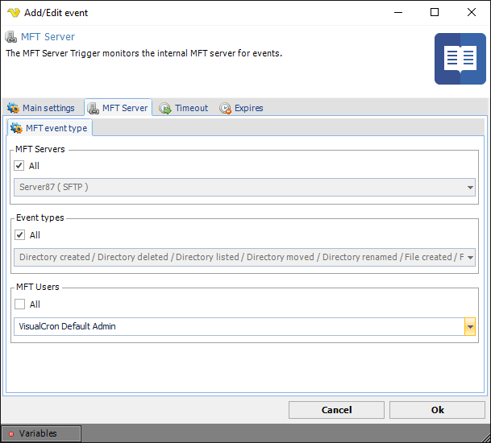

## MFT Server

The MFT Server event trigger monitors the internal MFT server for events. General creation and configuration of MFT server is made in [MFT Server Settings](mftserversettings).
 
**Triggers > Add > Event Trigger > MFT Server > MFT event type** sub tab

**MFT Server name**

Select all or a specific MFT endpoint.
 
**Event type**

Select all or specific MFT event type.
 
**User**

Select all or a specific User.