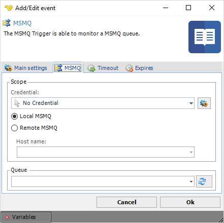
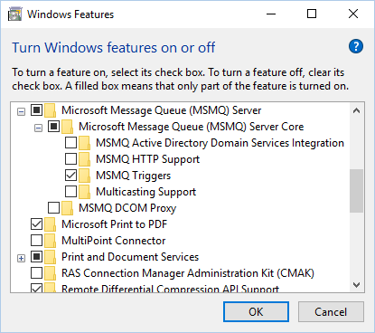

## Event Trigger - MSMQ

The MSMQ event trigger is able to monitor a private or public queue for new messages. When a new message arrives you can use VisualCron Variables to extract the information in the new message. To use this Trigger you need to setup a MSMQ Connection.
 
**Triggers > Add > Event Trigger > MSMQ** tab

**Credential**

Select a [Credential](../server/global-credentials) if you are going to monitor a remote MSMQ queue. Click the Settings icon to populate the drop-down list with available credentials.
 
**Local/Remote MSMQ**

You can choose to monitor a local or a remote MSMQ Server. If you want to monitor a remote MSMQ Server you need to define a Host name.
 
**Queue**

Select the queue to be received. Click the Refresh icon to populate the drop-down list of queues.
 
## Troubleshooting:

*Error: Retrieving the COM class factory for component with CLSID `{1D9F85C0-9666-11D2-8927-0008C70C0622}` failed due to the following error: 80040154 Class not registered (Exception from HRESULT: 0x80040154 (REGDB_E_CLASSNOTREG)).*

Make sure you have installed MSMQ Triggers in Programs and Features dialog:

