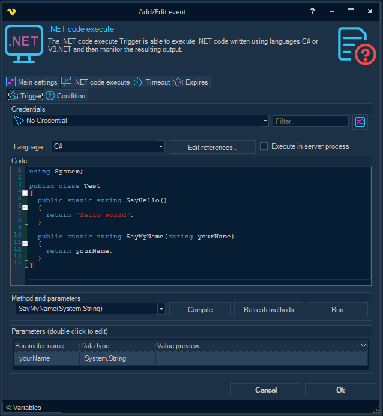
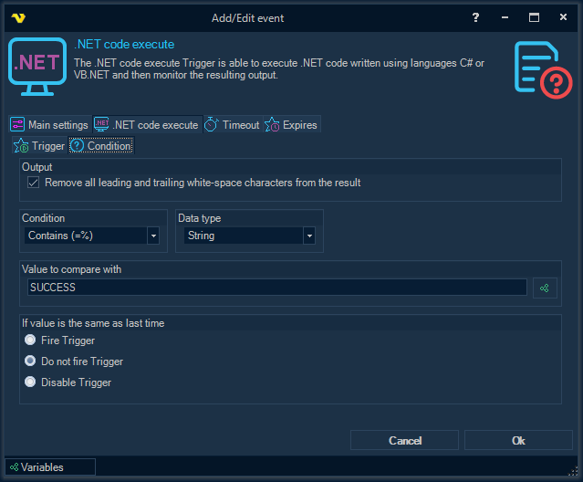

## Event Trigger - .NET Code Execute

The composition and purpose of all the parameters that are available inside the Trigger sub tab fully corresponds to the description of the parameters from the topic, which describes the [.NET code execute Task](../server/job-tasks-task-process-dot-net-code-execute).
 
.**NET code execute** tab > **Condition** sub tab

**Remove all leading and trailing white-space characters from the result**

All leading and trailing white-space characters are removed from the .NET code execution output before the condition is checked.
 
**Condition**

Select the comparison method.
 
**Data type**

Select the result data type and the value to compare with.
 
**Value to compare with**

Enter a value/Variable to compare the result with. Click the Variables icon to open the the Variables list.
 
**If value is the same as last time**

You can control what happens if the same value comes two times in a row. By default the Trigger fire each time the Condition is met.
 
 
**.NET code execute Trigger Result Variables**
 
**MatchedValue**

The string representation of the matched value from the .NET code execution output.