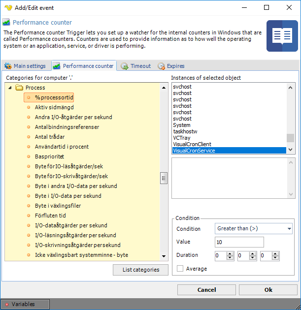
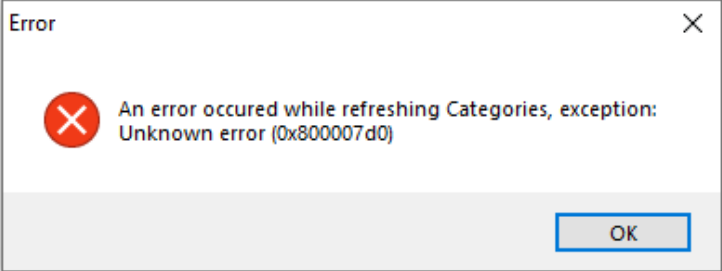

## Event Trigger - Performance Counter

The Performance counter Trigger lets you set up a watcher for the internal counters in Windows that are called Performance counters. Counters are used to provide information as to how well the operating system or an application, service, or driver is performing.
 
The counter data can help determine system bottlenecks and fine-tune system and application performance. The operating system, network, and devices provide counter data that an application can consume to provide users with a graphical view of how well the system is performing.
 
It is possible to monitor a remote computer by entering computer name and Credentials in the main settings.
 
**Triggers > Add > Event Trigger > Performance counter** tab

With VisualCron you can select a category and a specific instance of a counter to monitor a value. For example, in the screen shot below you can select the Process category with the % Processor time counter. This lets you monitor the CPU usage of a specific process. In the built in Conditions you can then select that (in this example); if this process is using more than 10% CPU for more than 10 seconds - then Trigger.
 
**Troubleshooting**
 
_0x800007d0 when trying to select categories_

Try right clicking on VisualCronClient.exe in installation folder and select Run as administrator.

