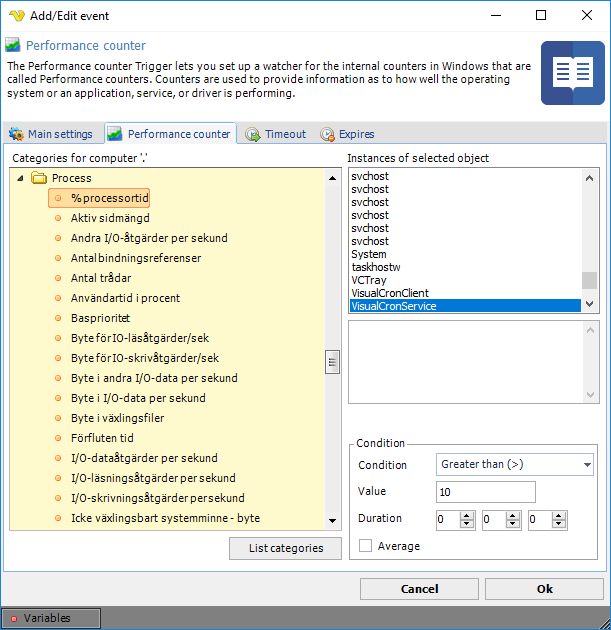
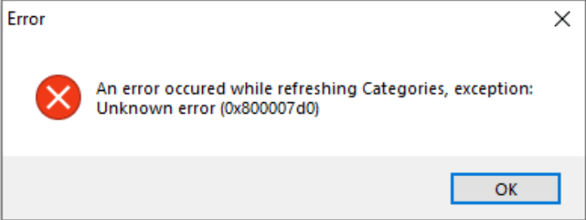

## Event Trigger - Performance Counter

The Performance counter Trigger lets you set up a watcher for the internal counters in Windows that are called Performance counters. Counters are used to provide information as to how well the operating system or an application, service, or driver is performing.
 
The counter data can help determine system bottlenecks and fine-tune system and application performance. The operating system, network, and devices provide counter data that an application can consume to provide users with a graphical view of how well the system is performing.
 
It is possible to monitor a remote computer by entering computer name and Credentials in the main settings.
 
**Triggers > Add > Event Trigger > Performance counter** tab

With VisualCron you can select a category and a specific instance of a counter to monitor a value. For example, in the screen shot below you can select the Process category with the % Processor time counter. This lets you monitor the CPU usage of a specific process. In the built in Conditions you can then select that (in this example); if this process is using more than 10% CPU for more than 10 seconds - then Trigger.

**List categories**

Click this button to fetch the available Performance Counter categories from the target computer. The header label above the tree shows which computer the categories were loaded from (for example, _Categories for computer '.'_ for the local machine).

**Categories**

A tree on the left side of the form that lists the available Performance Counter categories. Each category can be expanded to reveal the counters it contains. Select a counter in the tree to populate the _Instances_ list and the counter description on the right.

**Instances of selected object**

A list on the right side of the form that shows the available instances for the selected counter (for example, the running processes when the _Process_ category is chosen). Select the instance that should be monitored.

**Counter description**

A read-only text box below the instance list that displays the help text returned by Windows for the selected category or counter. This text is populated automatically as you navigate the tree.

**Condition**

Configures when the Trigger fires based on the value of the selected counter.

**Condition**

The comparison operator used to evaluate the counter value. The following operators are available:

* **Greater than (>)**
* **Greater or equal (>=)**
* **Equal (=)**
* **Less or equal (\<=)**
* **Less than (\<)**

**Value**

The threshold value the counter is compared against. Accepts a numeric (double) value. The default is `0`.

**Duration**

The length of time the condition must remain true before the Trigger fires. The duration is entered as three spinners for **Hours**, **Minutes** (0–59), and **Seconds** (0–59).

**Average**

When checked, the counter is sampled over the configured _Duration_ and the average of those samples is compared against the threshold, rather than requiring the condition to be continuously true.
 
**Troubleshooting**
 
_0x800007d0 when trying to select categories_

Try right clicking on VisualCronClient.exe in installation folder and select Run as administrator.
