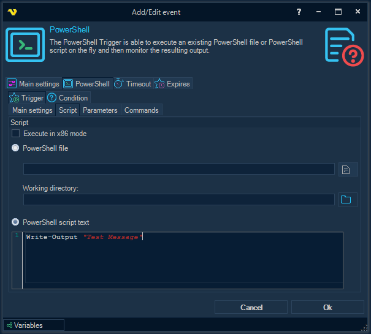
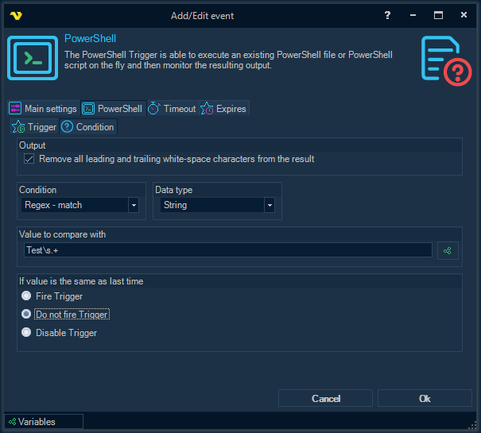

## Event Trigger - Powershell

The **PowerShell Trigger** is able to execute an existing PowerShell file or PowerShell script on the fly and then monitor the resulting output.
 
**Triggers > Add > Event Trigger > PowerShell > PowerShell** tab > **Trigger** sub tab

Inside the **Trigger** sub tab there are four inner tabs: **Main settings**, **Script**, **Parameters** and **Commands**.
The composition and purpose of all the parameters that are available in the inner tabs fully corresponds to the description of the parameters from the topic, which describes the PowerShell Task.
 
**PowerShell** tab > **Condition** sub tab

**Remove all leading and trailing white-space characters from the result**

All leading and trailing white-space characters are removed from the PowerShell script output before the condition is checked.
 
**Condition**

Select the comparison method.
 
**Data type**

Select the result data type and the value to compare with.
 
**Value to compare with**

Enter a value/Variable to compare the result with. Click the Variables icon to open the the Variables list.
 
**If value is the same as last time**

You can control what happens if the same value comes two times in a row. By default the Trigger fire each time the Condition is met.
 
 
**PowerShell Trigger Result Variables**
 
**MatchedValue**

The string representation of the matched value from the PowerShell script output.