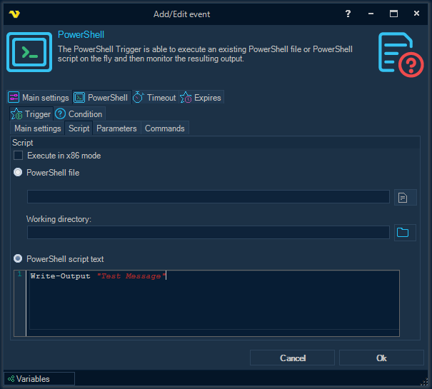
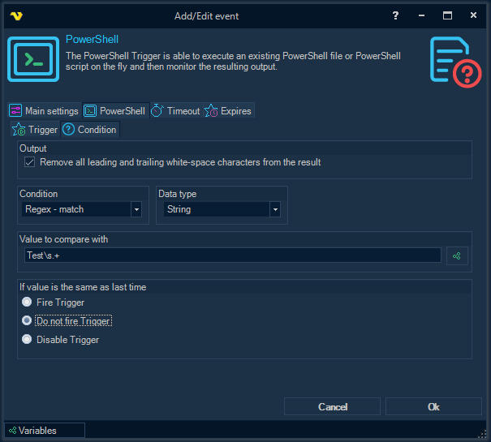

## Event Trigger - Powershell

The **PowerShell Trigger** is able to execute an existing PowerShell file or PowerShell script on the fly and then monitor the resulting output.
 
**Triggers > Add > Event Trigger > PowerShell > PowerShell** tab > **Trigger** sub tab

Inside the **Trigger** sub tab there are four inner tabs: **Main settings**, **Script**, **Parameters** and **Commands**.
The composition and purpose of all the parameters that are available in the inner tabs fully corresponds to the description of the parameters from the topic, which describes the PowerShell Task.
 
**PowerShell** tab > **Condition** sub tab

**Output**

**Remove all leading and trailing white-space characters from the result**

All leading and trailing white-space characters are removed from the PowerShell script output before the condition is checked. This option is enabled by default.
 
**Data type**

Select the data type that the PowerShell script result should be interpreted as. The available comparison methods in the _Condition_ dropdown change depending on the selected data type:

* **String**
* **Boolean**
* **Int32**
* **Int64**
* **Decimal**
* **Double**

**Condition**

Select the comparison method that should be applied between the result and the _Value to compare with_. The list of available methods depends on the selected _Data type_:

* **Boolean** — _Equal_, _Not equal_
* **String** — _Equal_, _Not equal_, _Contains_, _Not contains_, _RegEx match_, _RegEx no match_
* **Int32 / Int64 / Decimal / Double** — _Equal_, _Not equal_, _Larger_, _Larger or equal_, _Smaller_, _Smaller or equal_, _Contains_
 
**Value to compare with**

Enter a value/Variable to compare the result with. Click the Variables icon to open the the Variables list.
 
**If value is the same as last time**

Choose how the Trigger should behave when the new result matches the previous result:

* **Fire Trigger** — fire the Trigger every time the Condition is met (default)
* **Do not fire Trigger** — skip firing when the result is the same as last time
* **Disable Trigger** — disable the Trigger after a repeated identical match
 
**PowerShell Trigger Result Variables**
 
**MatchedValue**

The string representation of the matched value from the PowerShell script output.
