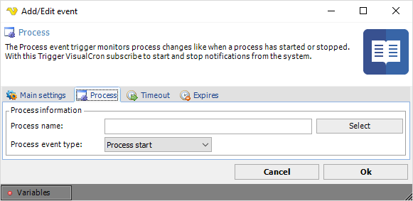

## Event Trigger - Process

The Process event trigger monitors process changes like when a process has started or stopped. With this Trigger VisualCron subscribe to start and stop notifications from the system.
 
**Triggers > Add > Event Trigger > Process** tab

**Process name**

Enter a process name which is listed in the Task Manager, e.g. "WINWORD.EXE". A list of processes from the server can be retrieved by clicking on the Select process button. In the list window, double-click on the desired process for selection. Note that the process name is case sensitive.
 
**Process Event type**

"Process start" it means that you are monitoring for new, created, processes. "Process end" means watching for termination of a running process.