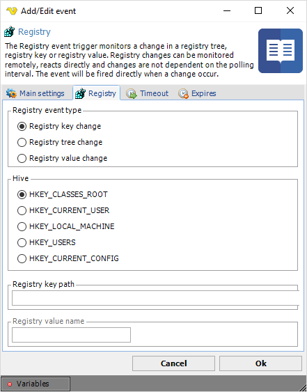

## Event Trigger - Registry

The Registry event trigger monitors a change in a registry tree, registry key or registry value. Registry changes can be monitored remotely, reacts directly and changes are not dependent on the polling interval. The event will be fired directly when a change occur.
 
Many programs and Windows itself stores information and change information during a Windows session. This event trigger is based on **WMI**.
 
You can examine the registry settings by starting "regedit.exe" from a Windows command window.
 
**Triggers > Add > Event Trigger > Registry** tab



**Registry event type**

The registry can be monitored for changes in the following ways:
* "RegistryKeyChange" - represents changes to a specific key. The changes apply only to the key, not its sub keys
* "RegistryTreeChange" - represents changes to a key and its sub keys
* "RegistryValueChange" - represents changes to a single value of a specific key
 
**Hive**

Name of the hive that contains the key (or keys) that is changed.
 
**Registry key path**

Path to the registry key. Use backspaces to separate trees. Do not start with a backspace. Registry Key  
path example: "SOFTWARE\Microsoft\DirectX". Do not include the hive.
 
**Registry value name**

Name of the value in the registry key.
Example: "InstalledVersion" located in ```RegistryKeyPath: SOFTWARE\Microsoft\DirectX```.

