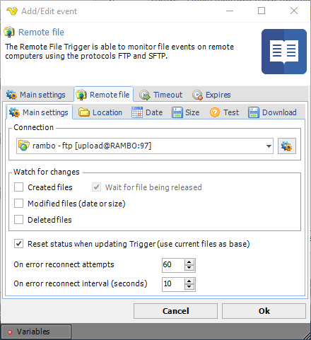
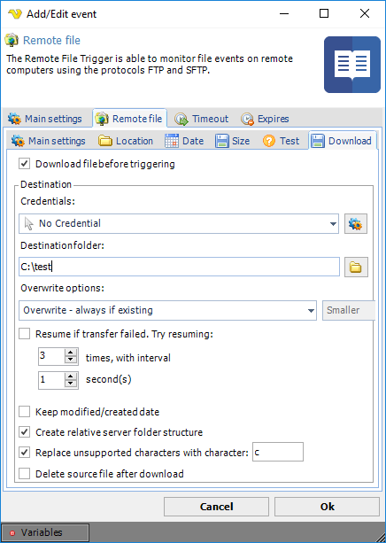
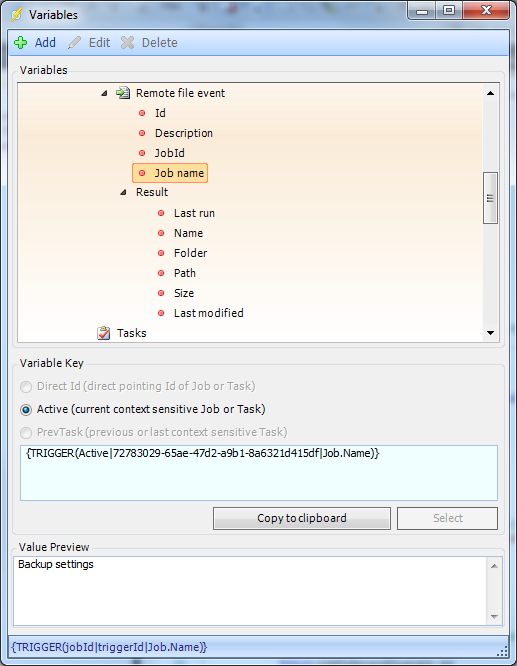

## Event Trigger - Remote File

The Remote File event trigger is able to monitor file events on remote computers using the protocols FTP, SFTP and SCP.

**Triggers > Add > Event Trigger > Remote file > Main settings** tab

**Connection**

This Trigger uses the centrally stored Connections. Available protocol types are listed here. Click on Manage Connections to add a new one.
 
**Watch for changes**

You are able to watch for new, modified and deleted files. Select what you want the Trigger to fire for.
 
**Wait for file being released**

The Trigger will monitor a new file for modify date. If modify date has not changed since last check the Trigger will fire 'Created' event.
 
**Reset status when updating Trigger (use current files as base)**

This reloads the internal list of files. You should check this if you for some reason change the Connection.
 
**On error reconnect attempts**

Let say the remote server you watch gets disconnected for some reason, perhaps the network or computer is down. The reconnect attempts value controls how many times VisualCron tries to reconnect. Default value is 3 times.
 
**On error reconnect interval (_seconds_)**

Let say the remote server you watch gets disconnected for some reason, perhaps the network or computer is down. The reconnect interval which you can specify is the number of seconds it will wait between each reconnect attempt, in seconds. Value 1 to 500 is available. Default is 5 seconds which may be a long time when the network is down and a short time if the remote computer is down. VisualCron attempts to reconnect 3 times by default.

**Triggers > Add > Event Trigger > Remote file > Location** tab

This Task is using the standard VisualCron [Folder filter](folderfilter) to find one or more folders.
 
**Triggers > Add > Event Trigger > Remote file > Date** tab

This Task is using the standard VisualCron [Folder filter](folderfilter) to filter for created/modified date.
 
**Triggers > Add > Event Trigger > Remote file > Size** tab

This Task is using the standard VisualCron [Folder filter](folderfilter) to filter out files based on size.
 
**Triggers > Add > Event Trigger > Remote file > Test** tab

This Task is using the standard VisualCron [Folder filter](folderfiler) to test your current file filter - if it matches any existing files.
 
**Triggers > Add > Event Trigger > Remote file > Download** tab

**Download file before triggering**

Optionally, you can set the Remote file Trigger to download the file that was just Triggered.
 
**Credential**

Select a [Credential](credential) if you are going to save to a network drive. Click the Settings icon to populate the drop-down list with available credentials.
 
**Destination folder**

The local folder where the file should be saved.
 
**Overwrite options**

If the file exists you can choose different overwrite options.
 
**Resume transfer if failed**

If an error occurs while downloading the file you can choose to retry X times and wait Y seconds between each retry.
 
**Keep modified/created date**

This option will set the same modified and creation date as the on the ftp.
 
**Keep modified/created date**

Sets the modified/created date on locally downloaded files to the same dates as the remote files.
 
**Create relative folder structure**

Creates relative folders if checked. If not checked all files (in sub folders) will be saved to destination folder.
 
**Replace unsupported characters with character**

If checked, VisualCron will replace any character that is not supported in Windows file system with the specified character.
 
**Delete source file after download**

Optionally delete the remote file after download.
 
**Triggers > Add > Event Trigger > Remote file > Variables**

**Last run**

When the Trigger was last run.
 
**Name**

The name of the file that was created/modified/deleted.
 
**Folder**

The folder of the file that was created/modified/deleted.
 
**Path**

The full path to the file that was created/modified/deleted.
 
**Size**

The size of the file that was created/modified/deleted.
 
**Last modified**

The last modified date of the file that was created/modified/deleted.