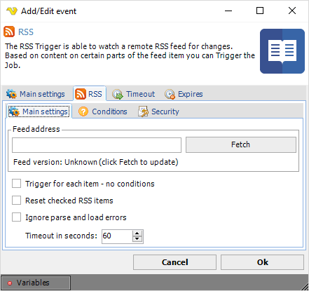
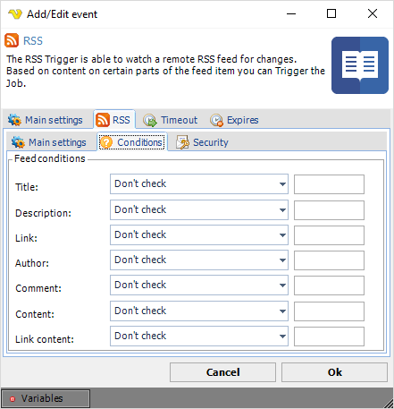
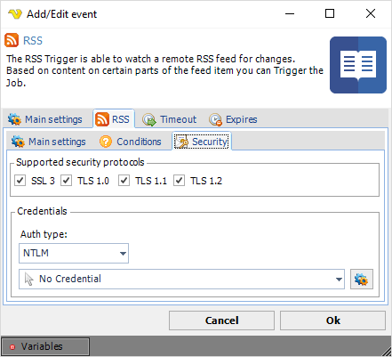
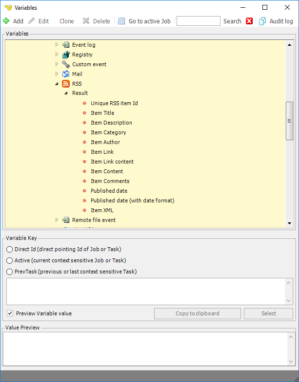

## Event Trigger - RSS

The RSS event trigger is able to watch a remote RSS feed for changes.  Based on content on certain parts of the feed item you can Trigger the Job.
 
**Triggers > Add > Event Trigger > RSS > Main settings** tab

**Feed address**

Text ... Click the Fetch button to
 
**Trigger for each item - no conditions**

Check this option if you just want to know when a feed has been updated. This setting will fire the Trigger each time a new item has been added.
 
**Reset checked RSS items**

Text ...
 
**Ignore parse and load errors**

Text ...
 
**Timeout in seconds**

Text ...
 
:::tip Note 

As for all event triggers we recommend that you set "Put Job in queue" in the man settings of the Job. This will force VisualCron to process one item at a time. For example, if you let your RSS Trigger check every 60 seconds and two new items has been added since last check - then VisualCron will Trigger twice. In order to be able to use Variables from the Trigger correctly "Put Job in queue" needs to be set otherwise a mixup of Variables is possible.

:::

**Triggers > Add > Event Trigger > RSS > Conditions** tab

**Triggers > Add > Event Trigger > RSS > Security** tab

**Supported security protocols**

Text ...
 
**Auth type**

Text ...
 
**Credential**

Select a [Credential](credential) suitable for the selected authentication type. Click the Settings icon to populate the drop-down list with available credentials.
 
**RSS Event Trigger Variables**

In the Variables window you can find related Variables from the Trigger.