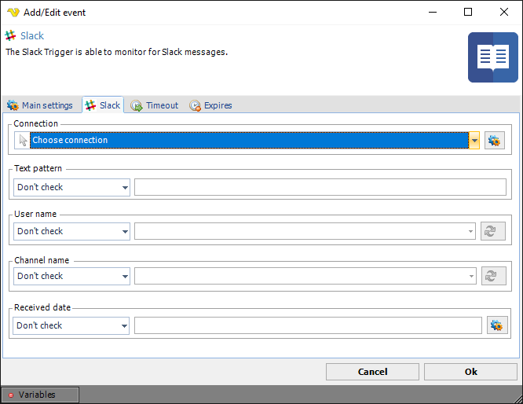

## Event Trigger - Slack

The Slack Event Triggers triggers on new messages in the Slack cloud. This Trigger is using the [Slack Connection](slackconnection).

**Connection**

Select a [Slack Connection](slackconnection).
 
**Text pattern**

Select a condition to match the Slack message text.
 
**User name**

Select a condition to match the Slack message sender.
 
**Channel name**

Select a condition to match the Slack channel.
 
**Received date**

Select a condition to match the Slack message received date.