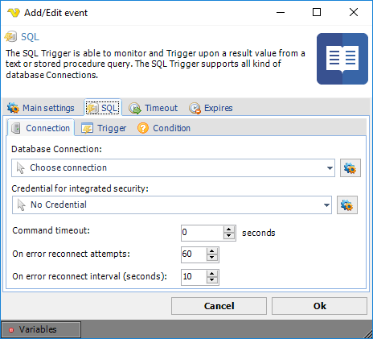
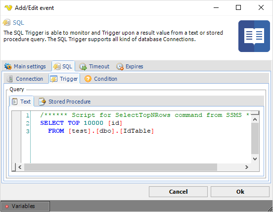
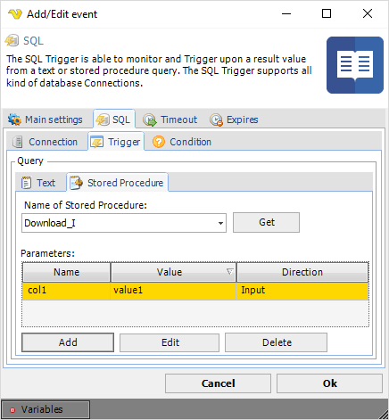
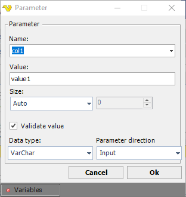
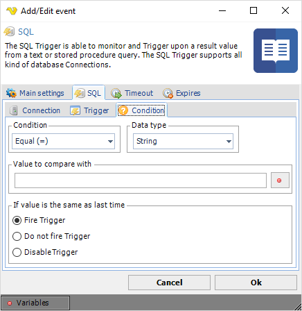

## Event Trigger - SQL

The SQL event trigger is able to monitor and Trigger upon a result value from a text or stored procedure query. The SQL Trigger supports all kind of database Connections.
 
**Triggers > Add > Event Trigger > SQL > Connection** sub tab

**Database Connection**

Select an existing database [Connection](../server/global-connections), if not existing you need to create one first. Click the Settings icon to open the Manage Connections dialog. Once a connection is added you can select it in the combo box.
 
**Credential for integrated security**

If your [Credential](../server/global-credentials) requires integrated security you should select a Windows user that has access to database. Click the Settings icon to populate the drop-down list with available Credentials.
 
**Command timeout**

How long time before the query times out.
 
**Triggers > Add > Event Trigger > SQL > Trigger > Text** sub tab

Enter the query in the text field. If you have a stored procedure - select the stored procedure tab.
 
**Triggers > Add > Event Trigger > SQL > Trigger > Stored procedure** sub tab

Enter the name of the stored procedure to execute. The grid shows all parameters. When clicking on the Add button, a parameter window will open. Enter parameter values for Name, Value, Data type and Parameter direction.

**Validate value**

If this value is checked VisualCron will validate the value against the value type. Unselect this if you are using a Variable as value and this Variable is not yet set.
 
Test your SQL Task before closing the VisualCron client. Errors will be reported in the log window.
 
**Triggers > Add > Event Trigger > SQL > Trigger > Condition** sub tab

**Condition**

Select the comparison method.
 
**Data type**

Select the result data type and the value to compare with.
 
**Value to compare with**

Enter a value/Variable to compare the result with. Click the Variables icon to open the the Variables list.
 
**If value is the same as last time**

You can control what happens if the same value comes two times in a row. By default the Trigger fire each time the Condition is met.