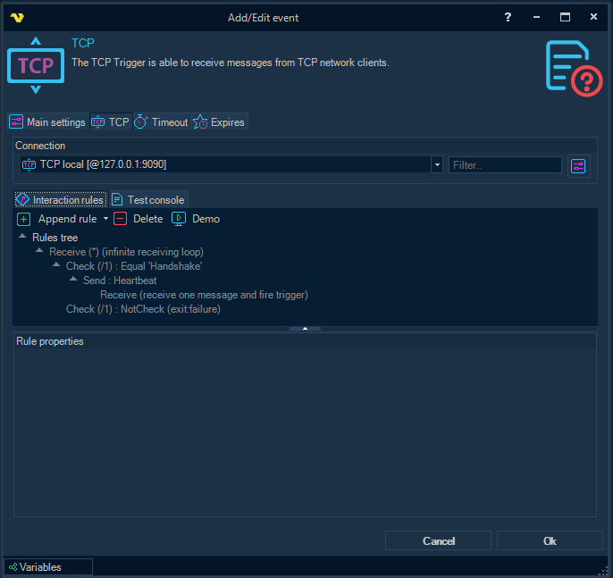
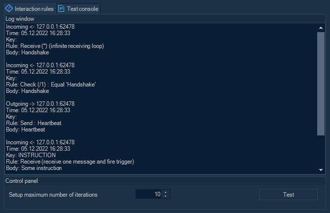

## Event Trigger - TCP

The TCP Trigger creates a TCP Listener which then listens persistently for connections from TCP network clients. For each established connection, the server communicates with the client based on the logic configured using some messaging rules.
 
**TCP > Connection** group and **Interaction rules** inner tab



**Connection**

Before configuring any interaction rules you must create a Connection. Click on Manage Connections to add a new Connection. Select [TCP connection](tcpconnection) and alter connection settings.
 
**Interaction rules** tab

The tab contains a toolbar with commands to configure a tree-like structure, which, in turn, is used for setting up the messaging logic between the TCP server (listener) and the TCP client.
 
Available commands:

**Append rule**: append a rule of some type (send a message, receive a message, or check the received message body).
**Delete**: delete a rule with all child rules.
**Demo**: automatically create a set of rules with an example of a simple communication algorithm between a client and a server.
 
See "[TCP messaging rules](tcpmessagingrules)" section in the TCP Task topic.
 
**TCP > Test console** inner tab



You are able to test the configured messaging rules without saving the settings.
As a remote TCP client, a similar test scenario can be launched in the [TCP Task](tcptask) UI form, or a test application can be compiled and launched (see sample TCP Client application code below).
 
**Setup maximum number of iterations**

All rules with a large or infinite number of repetitions automatically terminate after the specified maximum number of iterations.
 
**TCP Trigger Result Variables**
 
**TextBody**

The triggered message content decoded with connection's codepage.
 
**ReceivedTime**

The triggered message receipt time.
 
**FromAddress**

The triggered message sender address in the form "host:port".
 
**Messages**

A list of processed messages in the form { Key, TextBody }, so that the text of a particular message is available by specifying Key in a variable template.
 
**_Attention_:** when using variables with the result of TCP trigger in tasks, for example ```{TRIGGER(...|TCP.Result.TCP.TextBody)}```, it should be mentioned that in case of simultaneous connection of several TCP clients, the content of a variable may change unexpectedly. In practice, a trigger may fire twice when receiving messages from two different clients, but the value of ```{TRIGGER(...|TCP.Result.TCP.TextBody)}``` will contain the message that came last.
 
**Sample TCP Client application code** (_C#_)

```c#
using System.Net.Sockets;
using System.Text;
 
namespace TCP_Client
{
  internal class Program
   {
      static void Main()
       {
          /*
            * Connecting
            */
          using var tcpclnt = new TcpClient();
           Console.WriteLine("Connecting .....");
 
           tcpclnt.Connect("127.0.0.1", 9090);
          using var stm = tcpclnt.GetStream();
 
          if (stm.CanWrite)
           {
               Console.WriteLine("Connected");
               Thread.Sleep(1000);
           }
          else
           {
               Console.WriteLine("The stream is unavailable");
              return;
           }
           
          /*
            * WARNING:
            *   the encoding should be the same as configured in the TCP Connection / Common settings / Code page
            */
          var enc = Encoding.UTF8;
          string message;
          byte[] buffer;
 
          /*
            * Sending "Handshake"
            */
           message = "Handshake";
           Console.WriteLine();
           Console.WriteLine($"Sending '{message}' .....");
           buffer = enc.GetBytes(message);
           stm.Write(buffer, 0, buffer.Length);
 
           Console.WriteLine($"'{message}' sent");
           Thread.Sleep(1000);
 
          /*
            * Receiving a response
            */
           Console.WriteLine();
           Console.WriteLine("Receiving .....");
           buffer = new byte[tcpclnt.ReceiveBufferSize];
          var cnt = stm.Read(buffer, 0, buffer.Length);
 
           message = enc.GetString(buffer, 0, cnt);
           Console.WriteLine("Message received : " + message);
 
          /*
            * Checking the response
            */
          const string heartbeat_response = "Heartbeat";
          if (message == heartbeat_response)
           {
               Console.WriteLine("Response checked. Ready to send a command");
               Thread.Sleep(1000);
           }
          else
           {
               Console.WriteLine($"The response is invalid. Must be '{heartbeat_response}'");
              return;
           }
 
          /*
            * Sending some command
            */
           Console.WriteLine();
           Console.Write("Enter the command to be transmitted : ");
           message = Console.ReadLine() ?? string.Empty;
 
           Console.WriteLine($"Sending '{message}' .....");
           buffer = enc.GetBytes(message);
           stm.Write(buffer, 0, buffer.Length);
 
           Console.WriteLine("Command sent.");
           Console.WriteLine("Exit.");
       }
   }
}
```