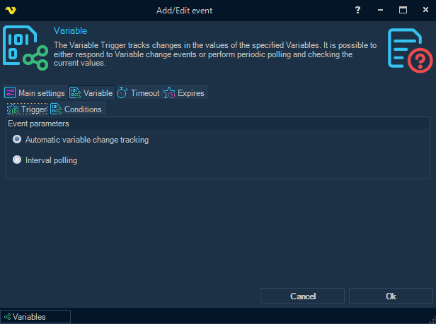
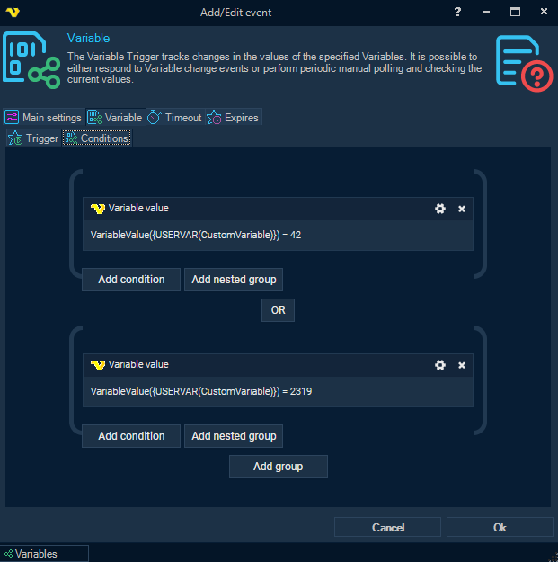
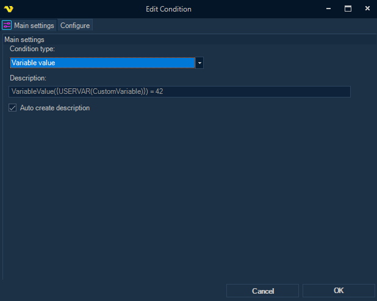
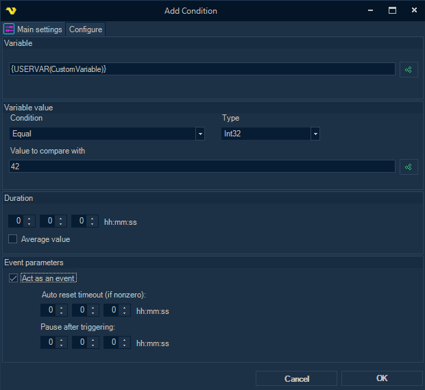
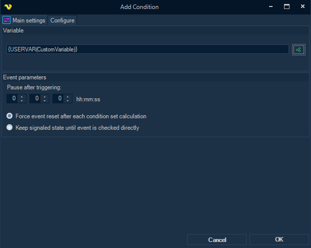

## Event Trigger - Variable

The **Variable Trigger** tracks changes in the values of the specified Variables. It is possible to either respond to Variable change events or perform periodic polling and checking the current values.
 
**Triggers > Add > Event Trigger > Variable > Variable** tab > **Trigger** sub tab



**Automatic variable change tracking**

Fire the trigger if the configured condition (or a group of conditions) has been met and either the condition acts as an event or a mismatched condition state was previously detected. Polling interval is ignored.
 
**Interval polling**

Perform a check of configured conditions at intervals specified in Main settings. Fire the trigger if conditions are met.
 
**Variable** tab > **Conditions** sub tab



One or more conditions can be configured here.
By default, conditions are linked with the AND operator, but if necessary, the conditions can be combined into groups, and the groups can be linked with the OR operator.
 
**Conditions** sub tab > **Add condition** > **Main Settings** tab



There are currently two types of conditions supported:
 
**Variable value**

A state-check condition that checks the current value of a Variable against a given criterion.
Allows the duration, including the calculation of the average value if a numeric value type is selected.
Can act as an event, so that the next match of the condition is possible only after an unmatched state is detected or the reset timeout expires.
 
**Variable value changed**

An event-based condition that triggers every time the value of a Variable changes from its previous value.
 
 
**Conditions** sub tab > **Add condition > Variable value** condition type **> Configure** tab



**Variable**

Variable, or a combination of several Variables, the value of which is checked in the condition.
 
**Condition**

Comparison operator for the current Variable value and the "Value to compare with".
 
**Type**

Variable value type.
 
**Value to compare with**

Can be a specific value, or another Variable.
 
**Duration**

All values of the Variable obtained during the specified period are checked against the criterion.
 
**Average value**

The average value of all values of the Variable obtained during the specified period of time is checked against the criterion.
 
**Act as an event**

If enabled, the next match of the state-check condition is possible only after an unmatched state is detected or the reset timeout expires.
 
**Auto reset timeout**

If nonzero, the condition can trigger again after the specified timeout, even if the state matched all the time.
 
**Pause after triggering**

The period of time after previous triggering when the event generation is suppressed.
However, if while waiting for the end of the suppression period, the state changes to non-matching, and then changes back to matching, then immediately after the end of the suppression period, the condition will be triggered again.
 
**Conditions** sub tab **> Add condition > Variable value changed** condition type > **Configure** tab



**Variable**

Variable, or a combination of several Variables, the value of which is checked in the condition.
 
**Pause after triggering**

The period of time after previous triggering when the event generation is suppressed.
If an event occurs in the system before the suppression period has ended, the event will be ignored.
 
**Force event reset after each condition set calculation**

The state will be set to nonsignaled when calculating the entire condition tree, regardless of whether the event is checked directly or not.
 
**Keep signaled state until event is checked directly**

The event will remain in the signaled state until it is checked directly during condition calculations.
 
#### Variable Trigger Result Variables
 
**EvaluatedExpression**

The general evaluated expression of all configured conditions, for example: "VariableValue(`{USERVAR(CustomVariable)}`):42 = 42 OR VariableValue(`{USERVAR(CustomVariable)}`) = 2319".
 
**ConditionId|Success**

Check status of a certain condition.
 
**ConditionId|ActualParameterValue**

The actual Variable value of a certain condition.
 
**ConditionId|EvaluatedExpression**

The evaluated expression of a certain condition.
 
### Configuration examples

### Type 1 - Interval Polling 

**Example 1.1 **

Every 10 minutes, check the value of the Variable "VarX". If the value is "X", run the Job. 

* set the polling interval to 600 (seconds) on the Main settings tab; 
* activate "Interval polling" mode on the Variable/Trigger tab; 
* add a new "Variable value" condition on the Variable/Conditions tab; 
* set up the condition parameters on the Configure tab: 
    * *Variable = `{USERVAR(VarX)}`*
    * *Condition = Equal*
    * *Value to compare with = X* 

**Example 1.2**

Every 10 minutes, check the average value of the numeric Variable "VarN" for the last 10 minutes.

If the average is above [```N```], run the Job.

* set the polling interval to 600 (seconds) on the Main settings tab;
* activate "Interval polling" mode on the Variable/Trigger tab;
* add a new "Variable value" condition on the Variable/Conditions tab;
* set up the condition parameters on the Configure tab:
    * *Variable = `{USERVAR(VarN)}`*
    * *Condition = Larger*
    * *Type = Int32*
    * *Value to compare with = [```N```]*
    * *Duration = 00:10:00*
    * *Average value = Checked*

### Type 2 - Variable Value Changed Event

**Example 2.1**

Run the Job every time the value of the Variable "VarX" changes.

* activate "Automatic variable change tracking" mode on the Variable/Trigger tab;
* add a new "Variable value changed" condition on the Variable/Conditions tab;
* set up the condition parameters on the Configure tab:
    * *Variable = `{USERVAR(VarX)}`*

**Example 2.2**

Run the Job every time the value of the Variable "VarX" changes, but no more than once per minute.

If the value has changed before 1 minute has elapsed since the previous change, ignore the change.

* activate "Automatic variable change tracking" mode on the Variable/Trigger tab;
* add a new "Variable value changed" condition on the Variable/Conditions tab;
* set up the condition parameters on the Configure tab:
    * *Variable = `{USERVAR(VarX)}`*
    * *Pause after triggering = 00:01:00*

**Example 2.3**

Run the Job every time the value of the numeric Variable "VarN" changes,
provided that the new value is less than [MinN] or greater than `[MaxN]` (i.e. is outside the tolerance interval).

* activate "Automatic variable change tracking" mode on the Variable/Trigger tab;
* add a new "Variable value changed" condition on the Variable/Conditions tab;
* set up the condition parameters on the Configure tab:
    * *Variable = `{USERVAR(VarN)}`*
 
* add another "Variable value" condition by pressing "Add group";
* set up the condition parameters on the Configure tab:
    * *Variable = `{USERVAR(VarN)}`*
    * *Condition = Smaller*
    * *Type = Int32*
    * *Value to compare with = [```MinN```]*
 
* add another "Variable value" condition by pressing "Add nested group";
* set up the condition parameters on the Configure tab:
   * *Variable = `{USERVAR(VarN)}`*
   * *Condition = Larger*
   * *Type = Int32*
   * *Value to compare with = [```MaxN```]*
 
* set AND operator between the first two conditions
* set OR operator between the last two conditions

### Type 3 - Variable Value Becomes Matched The Condition

**Example 3.1**

Run the Job every time the value of the Variable "VarX" becomes "X".

* activate "Automatic variable change tracking" mode on the Variable/Trigger tab;
* add a new "Variable value" condition on the Variable/Conditions tab;
* set up the condition parameters on the Configure tab:
    * *Variable = `{USERVAR(VarX)}`*
    * *Condition = Equal*
    * *Value to compare with = X*

**Example 3.2**

Run the Job every time the value of the Variable "VarX" becomes "X",
and also run the Job every 10 minutes while the value remains equal to "X";
with the limitation of starting the Job no more than once per minute, so that if the value becomes "X" earlier, the Job will be executed with a delay of 1 minute after the previous run (if the value is still "X").

* activate "Automatic variable change tracking" mode on the Variable/Trigger tab;
* add a new "Variable value" condition on the Variable/Conditions tab;
* set up the condition parameters on the Configure tab:
    * *Variable = `{USERVAR(VarX)}`*
    * *Condition = Equal*
    * *Value to compare with = X*
    * *Act as an event = Checked*
    * *Auto reset timeout = 00:10:00*
    * *Pause after triggering = 00:01:00*

**Example 3.3**

Run the Job every time the value of the Variable "VarX" becomes "X",
provided that the value of the Variable "VarN" is equal to "N" at that moment.

* activate "Automatic variable change tracking" mode on the Variable/Trigger tab;
* add a new "Variable value" condition on the Variable/Conditions tab;
* set up the condition parameters on the Configure tab:
    * *Variable = `{USERVAR(VarX)}`*
    * *Condition = Equal*
    * *Value to compare with = X*
    * *Act as an event = Checked*
 
* add another "Variable value" condition by pressing "Add condition";
* set up the condition parameters on the Configure tab:
    * *Variable = `{USERVAR(VarN)}`*
    * *Condition = Equal*
    * *Value to compare with = N*

**Example 3.4**

Run the Job every time the value of the Variable "VarX" becomes "X", provided that the value of the Variable "VarN" has changed since the previous successful run.

*  activate "Automatic variable change tracking" mode on the Variable/Trigger tab;
* add a new "Variable value" condition on the Variable/Conditions tab;
* set up the condition parameters on the Configure tab:
    * *Variable = `{USERVAR(VarX)}`*
    * *Condition = Equal*
    * *Value to compare with = X*
    * *Act as an event = Checked*
 
* add another "Variable value changed" condition by pressing "Add condition";
* set up the condition parameters on the Configure tab:
    * *Variable = `{USERVAR(VarN)}`*
    * *Keep signaled state until event is checked directly = Checked*

