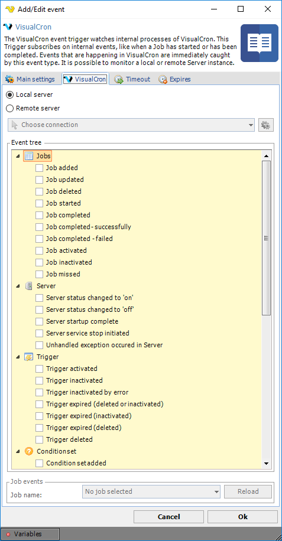

## Event Trigger - VisualCron

The VisualCron event trigger watches internal processes of VisualCron. This Trigger subscribes on internal events, like when a Job has started or has been completed. Events that are happening in VisualCron are immediately caught by this event type. It is possible to monitor a local or remote Server instance.

**Triggers > Add > Event Trigger > VisualCron** tab

**Local/Remote server**

You can choose to monitor the current local Server or a remote VisualCron Server. If you want to monitor a remote Server you need to select Remote server and define a VisualCron Connection.
 
**Job name**

If you select an internal Trigger of type Job you need to specify a Job name.
 
### VisualCron Events
 
### Jobs

**Job completed**

If the Job completes either successfully or fail.
 
**Job completed - successfully**

If the Job completes with success.
 
**Job completed - failed**

If the Job completes with failure.
 
**Job missed**

If the Job missed a Trigger according to schedule because Server was down or similar.
 
### Triggers
 
**Trigger inactivated**

Any user or other activity that deactivates the Trigger
 
**Trigger inactivated by error**

If a Trigger fails monitoring something, i.e. if Connection fails for too many times.
 
**Trigger expired (deleted or inactivated)**

If the Expiration enabled is set and the Expire action is any reason.
 
**Trigger expired (inactivated)**

If the Expiration enabled is set and the Expire action is Inactivate Trigger.
 
**Trigger expired (deleted)**

If the Expiration enabled is set and the Expire action is Delete Trigger.
 
**Trigger deleted**

If the Trigger is deleted.