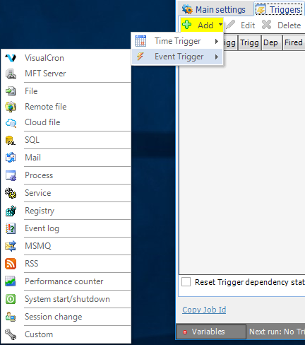
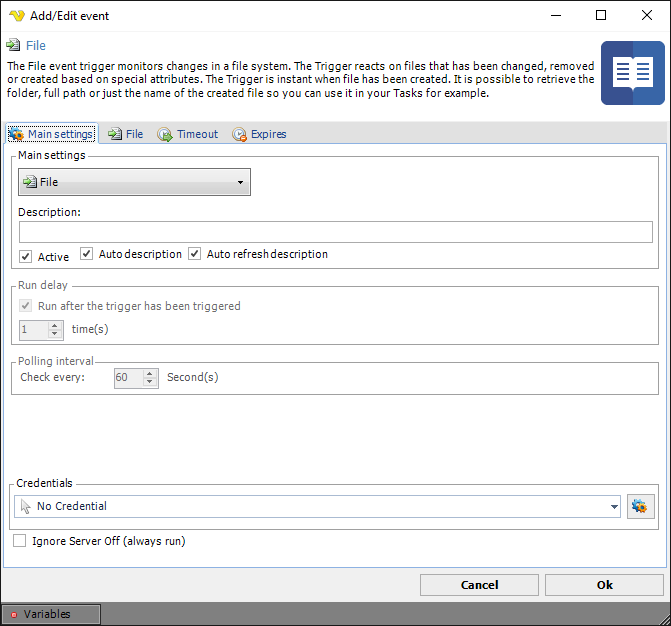
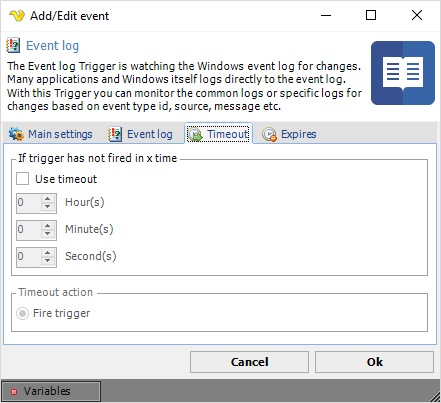
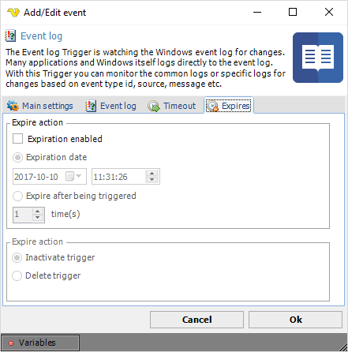

## Event Triggers

The event trigger is a complex and sensitive but also powerful way to monitor the system. Events in the system can trig your Job to run if that is the intention. An example is if your web server service dies and you want to know and act upon that.
 
Most events are based on the **WMI** (Windows Management Instrumentation) interface. **WMI** is a management technology allowing scripts to monitor and control managed resources throughout the network. Resources include hard drives, file systems, operating system settings, processes, services, shares, registry settings, networking components, event logs, users, and groups. **WMI** is built into clients with Windows 2000 or above, and can be installed on any other 32-bit Windows client.
 
Using a **WMI** based trigger, requires some common settings to control the behavior. These common settings are located in the **Main Settings** tab of the Event Trigger window.
 
**Security:** 

Some Triggers require higher privileges than the default privileges of the LocalSystem account. You need to either change the user that runs the VisualCron service to an administrator or add LocalSystem user to the administrators group (requires a restart of the server). This is especially true when trying to monitor a remote event, like monitoring an event log on another server.
 
**Warning:** 

Some event based triggers, like the File event type, can in some cases, trigger several times a second. This will run your Job several times a second.
 
In the **Triggers** tab, clicking on _Add > Event trigger_, a selection window for the different event trigger types is opened.

**Triggers > Add > Event Trigger > Main settings** tab

It is possible to change the event trigger type in the top combo box, which results in that the current trigger type tab is exchanged.
 
**Description**

Enter a description which will distinguish several triggers from each other in a trigger list.
 
**Auto description**

This will general a description automatically based on Trigger type and settings.
 
**Auto refresh description**

This forces update of the description even though it is not empty.
 
**Active**

Determines if the current event is active from start. If not, it can be reactivated later. Default is active.
 
**Run delay**

You can set a delay which means that the trigger will fire x number of times before executing. Default is 1 which means that the it will fire when the first time it has been triggered.
 
**Polling interval**

This value is only used by certain WMI events, otherwise grayed out. The polling interval defines how often VisualCron should check for changes in the system. Default is every 60 second. Setting it to a lower value than 10 will increase the load on the server. What's good is that you won't miss any events even though you are not checking it every second. Changes are stored and if something has happened you will be notified at your polling interval. What is important to know is that if you are watching for state "stopped" at a service and the service has started then stopped, any change has not occurred since the service was stopped in the first place. The service has to be started before monitoring a "stopped" change. Also, if the the service has started before monitoring and it turns from started to stopped within the polling interval no change is observed and you won't be notified.
 
**Remote event**

This value is only used by certain WMI events, otherwise grayed out. Can remotely monitor another computer in the network, specify the name or IP address of the remote computer. The computer has to be in the local network. Default is "." which means that VisualCron is monitoring the the local computer. A network credential must be specified when connecting to a remote computer. Also you must check so that the remote computer let's this computer or user access the WMI on the remote computer.
 
**Credentials**

To control a remote computer you may need to use a Credential. The Credential must match the user name and password of the user that you want to login for. Select a Credential in the combo box or click the Settings icon to open Manage credentials in order to add or edit Credentials.
 
**Ignore Server Off (always run)**

If checked, the Trigger will always run even though the Server status is Off.

**Triggers > Add > Event Trigger > Timeout** tab

**If trigger has not fired in x time**

Specify number of hours, minutes and seconds for the timeout.
 
**Timeout action**

When VisualCron detects the timeout it will fire the event.
 
**Triggers > Add > Event Trigger > Expires** tab

**Expiration enabled**

Check this option to enable an expiration type. You are able to set if a Trigger should be deleted or deactivated at a certain time or after a certain number of triggered times. Select either date or x time(s) the trigger has to fire before action.
 
**Expire action**

Select desired activity when a Trigger has expired. Choose between "Inactivate trigger" and "Delete trigger".