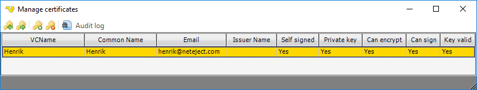
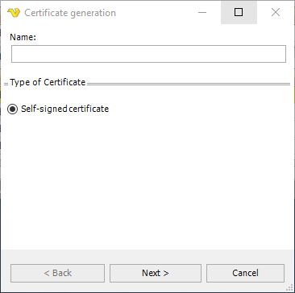
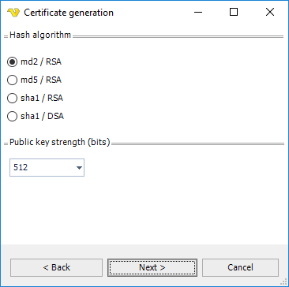
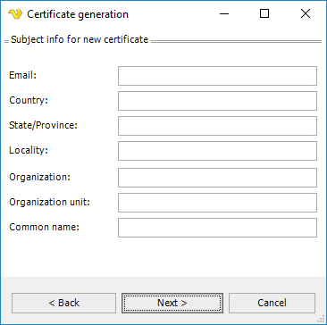
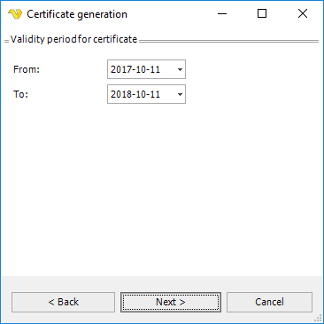
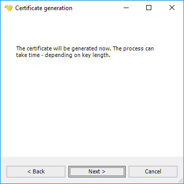

## Global - Certificates

A certificate is a digitally signed statement from one entity (person, company, etc.) that states that the public key of another entity has a particular value. Trusting the certificate's signature implies that you trust that the association in the certificate between the specified public key and the other entity are authentic.
 
VisualCron can handle standard X509 certificates. These can be stored at the server location and be available for reuse in Tasks like the [Email Task](../server/job-tasks/messaging-tasks/email). The Manage certificates dialog is available in the main menu **Server > Global objects > Certificates**.
 
**Global > Certificates**

The Manage certificates window lets you view currently stored Certificates and their properties.
 
### Import certificate

You can currently import certificates from files with the following format:
* PFX
* CER/DER/KEY
* PEM
* SPC/PVK
 
You import certificates by clicking the Import certificate icon. Remember to change the file filter to see your particular certificate file format.
 
### Export certificate

You can export in the following formats:
* PFX
* PEM
* CER/KEY
 
You export certificates by clicking the Export certificate icon. Change file filter to change file saving format.
 
### Create certificate

To start the Generate certificate wizard click on the Create certificate icon.
 
**Global > Certificates > Create**

Select type of certificate (currently only Self-signed certificate).
 
**Global > Certificates > Create 2**

**Hash algorithm**

Use this property to get or set algorithm that will be used for hash calculation.
 
**Public key strength**

Use this property to control the strength of the public key in bits.
 
**Global > Certificates > Create 3**

Enter subject info for the certificate. Remember to set the Email property if you are going to use the Certificate in the [Email Task](../server/job-tasks/messaging-tasks/email).
 
**Global > Certificates > Create 4**

Enter validity period for the certificate.
 
**Global > Certificates > Create 5**

Last step. Click on Next to generate Certificate.
 
**Delete certificate**

Select a certificate row and click on the Delete certificate icon.
 
### Certificate file formats supported by VisualCron

**PFX (PKCS#12)**: Binary file format, which allows storing of one or more certificates and associated private keys in one file in encrypted form. The keys are encrypted with password. Microsoft's implementation of PFX loader doesn't support TripleDES encryption, so you need to care about this issue when you save the certificate for further use with Microsoft software.
 
**PEM**: Certificate and private key format, which includes base64-encoded DER data and optional text headers , enclosed into special begin and end marks. Private keys can be encrypted using DES (tripleDES) agorithm. Certificate and key can be saved to one file. The file can even contain several certificates and keys. PEM format is used by OpenSSL package.
 
**SPC**: Binary file format, which allows storing of certificates only (no private keys). Several certificates can be saved in one file. Private keys are usually saved to a separate file in DER or PVK format. Some implementations encode the PKCS#7 format to base64 text encoding (and sometimes even with UTF16), but this is not standard-compliant.
 
**PVK**: Binary file format for storing private keys with password-based encryption.
 
**CER/DER/KEY**: Basic certificate and key format, which represents pure certificate and key data in binary ASN.1 notation. Certificates and keys are stored separately. Some implementations encode the DER format to base64 text encoding (and sometimes even with UTF16), but this is not standard-compliant.