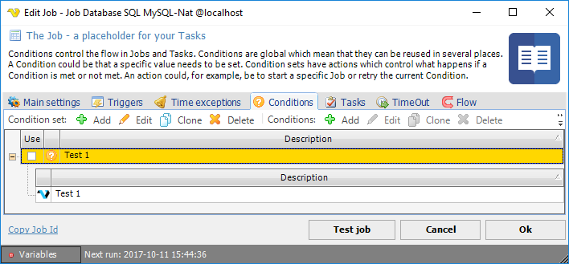

## Global - Conditions

Condition sets and the included conditions are "global", which means that once a condition set is defined, it can be selected by one or more Jobs and/or Tasks. However, a Job or a Task can only include one condition set. A condition set is defined either from the main menu **Server > Global objects > Conditions** dialog or the _Add/Edit_ Job or the _Add/Edit_ Task dialogs.
 
With conditions, the internal flow of Tasks included in a Job or the Job itself, can be controlled. Conditions are different kinds of "checks" which are evaluated before a Job or a Task is launched. One common condition could be if the previous Task returns an error based on the exit code. The outcome of the condition evaluation results in an action. The action could be to exit the Job because of the previous "failure".
 
Conditions are also evaluated before _Notifications_. If a condition check returns false then neither the Job/Task nor the notification is run. Thus the basic Job flow now looks like:

A condition set may include several conditions and these conditions can be of several types. The condition set criteria determine how the results of all included conditions are evaluated. The evaluation of a condition set can only result in one action, which affects the current or following Task or Job.
 
In the _Add/Edit_ Job or the _Add/Edit_ Task windows, click on the **Conditions** tab and you will see the currently defined condition set list.
 
**Edit Job > Conditions** tab

The condition set list consists of two bands, where the parent row is the condition set and the child rows are the conditions within the condition set.
 
**Use**

A condition can, by itself, be active or inactive. Check the _Use_ box to the left of each condition set for each set you want to activate for your Job or Task. If inactive, the condition will be ignored.