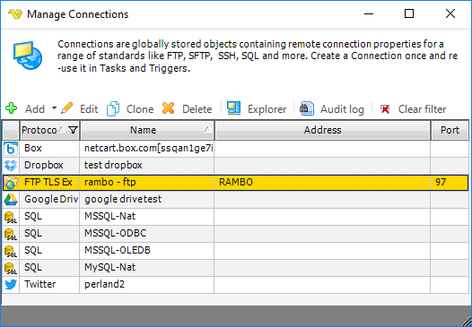

## Global - Connections

Based on the nature of some Jobs, Tasks or Notifications, a Connection is an essential part of the settings for that entity. Connections are global which means they are centrally stored and can be accessed by related Tasks and Triggers. Connections are used to specify to where and how VisualCron should connect to various instances like FTP servers, SQL servers etc. If a password to a FTP server has changed you only need to updated that in the Connection - not every Task it is used in.
 
Connections are viewed and updated in the **Server > Global objects > Connection**s window. The connections may also be managed by _Add/Edit Job -> Tasks -> Add/Edit -> Task type._ Connections are global, thus if you change a connection definition, this will affect all entities using this connection.

**Explorer**

Many connections use some kind of explorer to test and navigate with the selected Connection, for example; [SQL Explorer](../tools/explore-sql-explorer), [Connection Explorer](../tools/explore-connection-explorer). Select a Connection and click on Explorer button.
 
**Audit log**

Click this button to view the [Audit log](../tools/objects-audit-log) for Connections.
 
**Clear filter**

When you open Manage Connections from a Task only the related protocols are visible. Click Clear filter to view all.

Currently the following Connection protocols exist:
* [FTP](connection-ftp)
* [FTP SSL Implicit](connection-ftp)
* [FTP TLS Implicit](connection-ftp)
* [FTP SSL Explicit](connection-ftp)
* [FTP TLS Explicit](connection-ftp)
* [SFTP](connection-sftp)
* [SCP](connection-scp)
* [SSH](connection-ssh)
* [TCP](connection-tcp)
* [SMTP](connection-smtp)
* [POP3](connection-pop3)
* [IMAP](connection-imap4)
* [Exchange EWS](connection-exchange-ews)
* [Exchange WebDAV](connection-webdav)
* [WebDAV](connection-webdav)
* [SQL](connection-sql)
* [SSRS](connection-ssrs)
* [Amazon](connection-amazon)
* [Microsoft Azure](connection-microsoft-azure)
* [Dropbox](connection-dropbox)
* [Google Drive](connection-google-drive)
* [OneDrive](connection-onedrive)
* [Box](connection-box)
* [VisualCron](connection-visualcron)
* [SharePoint](connection-sharepoint)
* [XendApp](connection-xendapp)
* [Pushbullet](connection-pushbullet)
* [Telegram](connection-telegram)
* [Twitter](connection-twitter)
* [Crystal reports](connection-crystalreports)
* [VMWare](connection-vmware)
* [Dynamics CRM](connection-dynamics-crm)
* [AS/400](connection-as400)
* [SAP](connection-sap)
 
Click on protocol link above to read more information and connection setting specifics of that protocol.