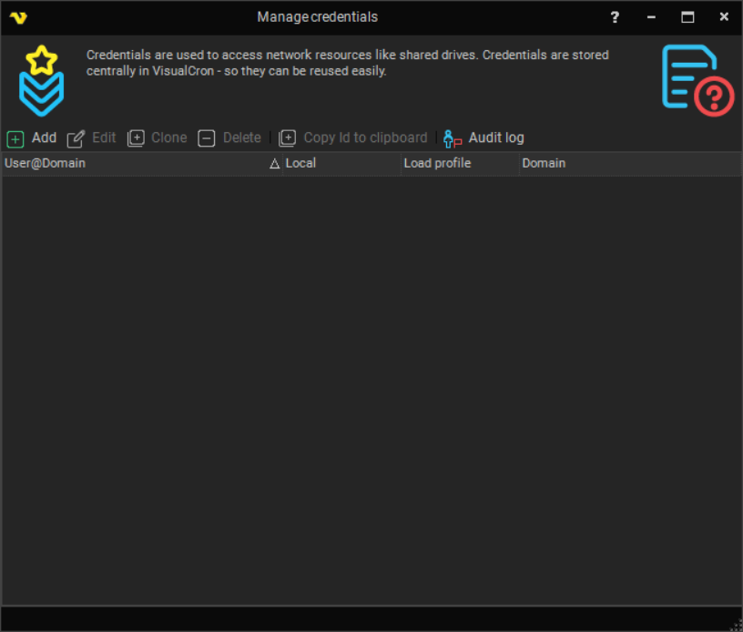
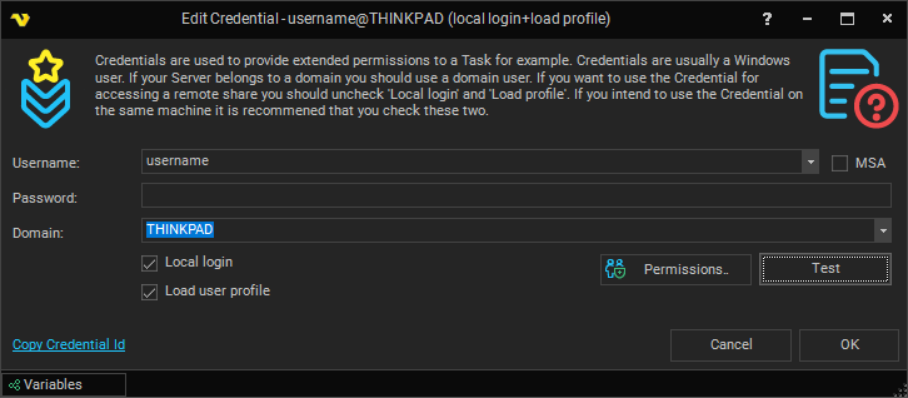
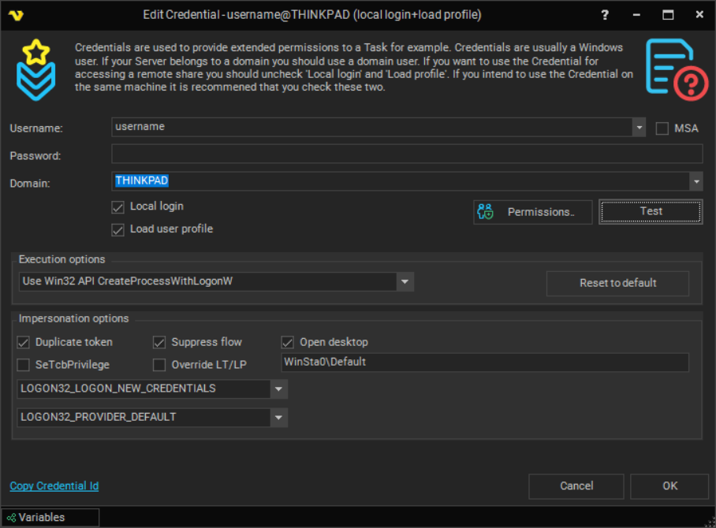
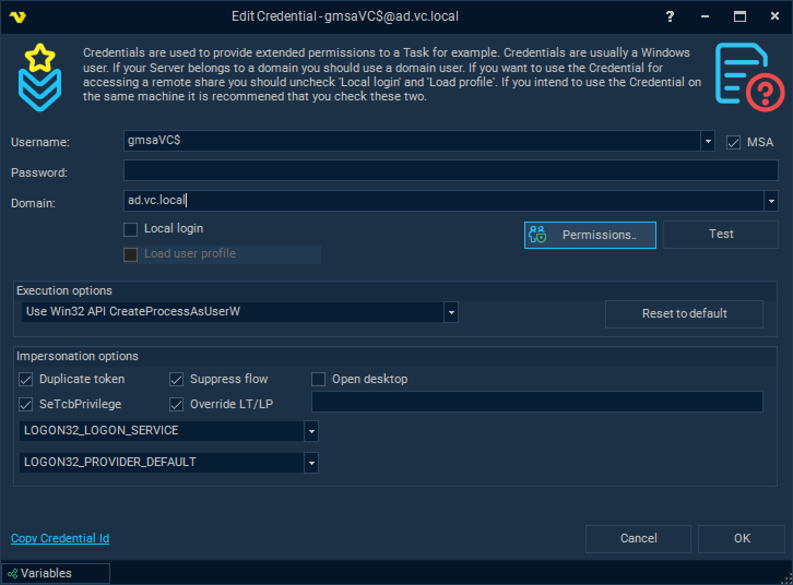
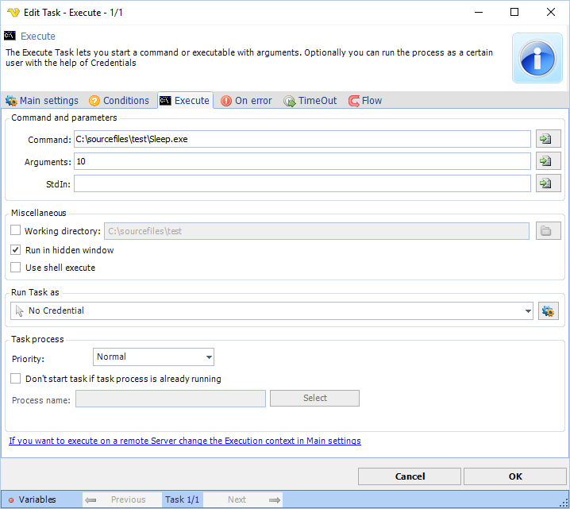

## Global - Credentials

Credentials are centrally stored in VisualCron for re-usage. Credentials might be needed in some of the following cases:

* Your Execute Task requires to run as a certain user to access certain rights
* You need to run an SQL with a trusted connection
* You need to do some kind of authentication against a web server
* Other permission request
 
Normally, all Tasks are launched from the VisualCron Server which runs as a service with LOCALSYSTEM account. That account may not have access to your network drives, certain folders etc. - that is why you need to use a Credential some times.
 
Credentials are encrypted when stored.
 
The Manage credentials window can be reached either from the main menu Server > Global objects > Credentials option.



### Editing a Credential



**Username**
 
Username for the user you want to logon.
 
**Password**
 
Password for the user you want to logon.
 
**Domain**
 
Domain or computer name/IP where you want to logon.
 
**Local login**
 
This tells VisualCron to perform a local logon. This checkbox should be unchecked if you are using Credentials to gain access to a network drive (using a user/domain on another server as Credential).
 
### Load  profile
 
This is used on local accounts that are on the same server as VisualCron is installed. This option is only available if *Local login* is checked.
 
When checked, the following steps are taken:
 
Log on, then load the user profile in the "HKEY_USERS" registry key. The function returns after the profile is loaded. Loading the profile can be time-consuming, so it is best to use this value only if you must access the information in the "HKEY_CURRENT_USER" registry key or you have to access network resources. Windows Server 2003 and Windows 2000: The profile is unloaded after the new process is terminated, whether or not it has created child processes. Windows XP: The profile is unloaded after the new process and all child processes it has created are terminated.
 
When not checked, the following steps are taken:
 
Log on, but use the specified credentials on the network only. The new process uses the same token as the caller, but the system creates a new logon session within LSA, and the process uses the specified credentials as the default credentials.  This value can be used to create a process that uses a different set of credentials locally than it does remotely. This is useful in inter-domain scenarios where there is no trust relationship. The system does not validate the specified credentials. Therefore, the process can start, but it may not have access to network resources. **If you just want to access a network drive** then you should specify the username, password and domain of the remote computer and use it with option "Network credentials only". To access network resources (from a local account) you have to use logon type: "With Profile". When you can - use "Network credentials only" as it is faster and takes less system resources. You must specify the UNC path. For example, you can't use the drive letter ```"Y:\yourfile.bat"```, you must use the path ```"\\server\folder\yourfile.bat"```.
 
**Extended debugging for server set to ON**
 
*In this case there are some additional options available for fine-tuning the login process*



### (g)MSA accounts
 
For setting up a (g)MSA account please refer screenshot below for valid settings in AD environment and check some of the prerequisites below:
 
1. Run the following Powershell command ```Get-ADServiceAccount -Identity <gMSA-account> -Properties PrincipalsAllowedToRetrieveManagedPassword``` to check if VisualCron Server host can retrieve gMSA account password. Update gMSA account if not.
2. Check is VisualCron Server service is running under account that has "Act as part of the operating system" privilege.
3. Check both AD domain controller and VisualCron server host to have the following security option enabled:
   Group policy editor - Computer Configuration -> Windows Settings -> Security Settings -> Local policies -> Security options -> Network security: Configure encryption types allowed for Kerberos
```<select all, at least one that fits your company security polices should be enabled>```



### Using and selecting a Credential
 
When you open the window, your current user name is written along with the name of your current computer/domain. Click on Add to create a centrally stored Credential. After adding the Credential it is available in all places where you can use Credentials. In those places you need to select the Credential you want to use like this:



### Troubleshooting
 
*Error -1073741502*

See [Execute Task](executetask)