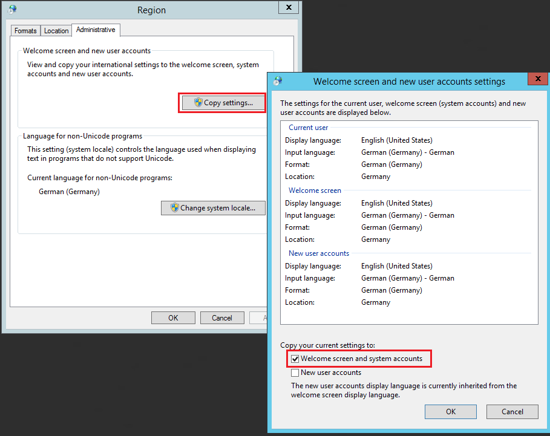

## Date/Time Variables

The following date/time field variables are used:

| Variable | Format |
| --- | --- |
| d | 08/17/2000 |
| D | Thursday, August 17, 2000 |
| f | Thursday, August 17, 2000 16:32 |
| F | Thursday, August 17, 2000 16:32:32 |
| g | 08/17/2000 16:32 |
| G | 08/17/2000 16:32:32 |
| m | August 17 |
| r | Thu, 17 Aug 2000 23:32:32 GMT |
| s | 2000-08-17T16:32:32 |
| t | 16:32 |
| T | 16:32:32 |
| u | 2000-08-17 23:32:32Z |
| U | Thursday, August 17, 2000 23:32:32 |
| y | August, 2000 | 
| d, dd, ddd, dddd | Current day of the month d, dd=numeric, ddd=abbreviation (ie, "Wed"), dddd=spelled out. |
| f, ff, fff, ffff, fffff | Fractions of a second, varying numbers of digits |
| h, hh Hours | 12 hour format |
| H, HH Hours | 24 hour format |
| m, mm: | Minutes |
| M, MM, MMM, MMMM | Month. MM = 2 digit, MMM = abbreviation (ie, "Jan"), MMMM=spelled out |
| s, ss | Seconds |
| t, tt | AM/PM indicator |
| y, yy, yyyy | Year | 
| z, zz, zzz | Time zone offset from GMT. Time separator |
| / | Date separator |
| Any other character | Other characters |
 
 
Examples

| Variable | Format |
| --- | --- |
| dddd, MMMM dd yyyy | Thursday, August 17 2000 |
| ddd, MMM d "'"yy | Thu, Aug 17 '00 |
| dddd, MMMM dd | Thursday, August 17 |
| M/yy | 8/00 | 
| dd-MM-yy | 17-08-00 |
 
Other time span options:
* totalmilliseconds
* totalseconds
* totalminutes
* totalhours
* totaldays
 
To get single date parts you can use percentage sign first:
 
```{DATEFORMAT(%M)}```

```{DATEFORMAT(%d)}```
 
More information:
[Microsoft date time strings](https://learn.microsoft.com/en-us/previous-versions/dotnet/netframework-1.1/az4se3k1(v=vs.71)?redirectedfrom=MSDN)
 
 
If you have a problem with Variables displaying other format than system it might be because you need to check the following below:



