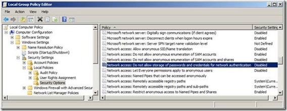
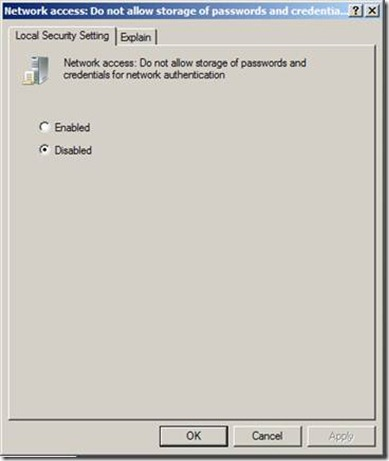

## Global - Network Drives

VisualCron is by default running as the SYSTEM account. One problem you may face is that you can't see/access your network drives. This is a restriction in Windows - that network drives are not shared between accounts.
 
To handle this, a way to control network drives from the system account is implemented. This enables map/disconnect network drives directly from VisualCron.
 
In the main menu, click on **Server > Global objects > Network drives** to access the interface for mapping/disconnecting.


**Map drive**

When mapping a drive you need to specify a Credential, a user that has access to the network drives, that is either a domain user or a user on the remote server. Specify a wanted drive name and path.
Path should be entered in UNC format like this: ```"\\servernameORip\folder\"```


Click on *Map drive* to map it. It is now controlled by VisualCron and each time VisualCron is started it tries to re-map the drives so these can be accessed after a server reboot.
 
**Reconnect**

If a drive has been disconnected during a VisualCron session you can reconnect it here.
 
 
### Troubleshooting

A specified logon session does not exist
 
Try disabling this policy:





*The specified network password is not correct*

Double check so that date and time is matching (synced) between VisualCron and server of remote share.
 
*Multiple connections to a server or shared resoource from the same user using multiple usernames are not allowed. Disconnect all previous verbands to the server or shared resource and try again.*

Try using the IP instead of the DNS name to the server.
 
*Access denied trying to connect to IFS (AS400) share*

Local Security Policy -> Local Policies –> Security Options -> Change Network security: LAN Manager authentication level to NTLMv2 session security if negotiated
[http://e1tips.com/2010/05/18/windows-vista-windows-7-ibm-iseries-ifs-mapped-drive/](http://e1tips.com/2010/05/18/windows-vista-windows-7-ibm-iseries-ifs-mapped-drive/)