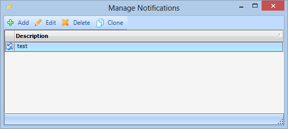
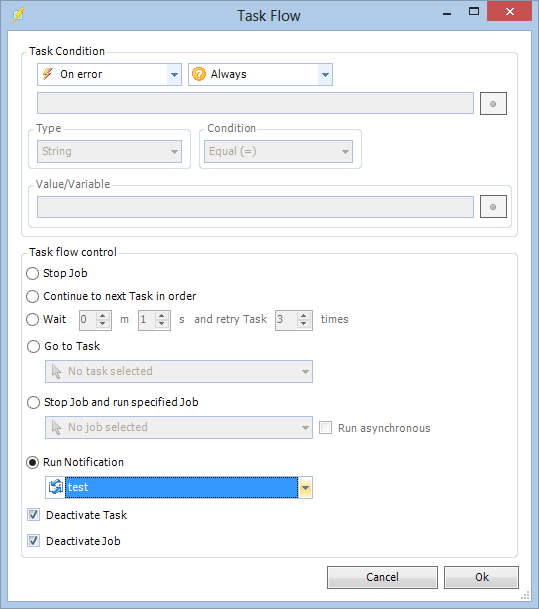

## Global - Notifications

Notifications are since version 7.0.0 a way to create global, independent Tasks. The Notifications are stored centrally and are called from [Job Flow](../../client-user-interface/server/job-flow) or [Task Flow](../../client-user-interface/server/task-flow). Any Task can be used as a Notification. The purpose of Notifications was originally to create, e.g. an Email Task once and then be able to re-use it in Job and Task Flow whenever you wanted to receive a Job or Task email with output or similar.
 
A notification is defined either from the main menu **Server > Global objects > Notification**s dialog or from the [Job Flow](../../client-user-interface/server/job-flow) or [Task Flow](../../client-user-interface/server/task-flow).

You can Add, Edit, Clone and Delete Notifications.
 
To get specific instructions for each Task Notification please visit the help page for the relevant Task.
 
Below is a screenshot from Task Flow of a Task which, On error, also sends a Notification 'test'.

**Variables**

As usual you can use any Variable in any field within VisualCron.
 
View additional [variable](../../client-user-interface/server/global-variables) information.
 
:::info Note

All variables are not available at all times. The variables are highly dependant on when you choose to notify. For example, specific Task variables are only available when you choose to Notify on start or Notify on complete. Also, if you choose to the variable Output you will get the output of the previous run when using when a Task has completed. The current output is not available until "when a Task has completed".

:::

### Notification Log

This is a section for information on Notification Log
