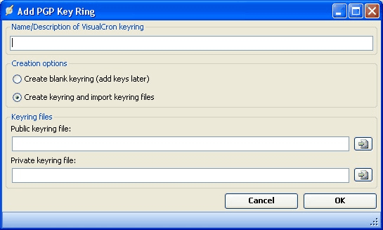

## Global - PGP Key Rings

**What is PGP?**

Pretty Good Privacy (PGP) is a strong encryption program used to encrypt files and e-mail. PGP is similar to PKI (Public Key Infrastructure) and is based on asymmetric (open-key) cryptography. The OpenPGP standard was originally derived from PGP.
 
**How PGP encryption works**

PGP encryption uses public-key cryptography and includes a system which binds the public keys to user identities. PGP message encryption uses asymmetric key encryption algorithms that use the public portion of a recipient's linked key pair, a public key, and a private key. The sender uses the recipient's public key to encrypt a shared key (a.k.a. a secret key or conventional key) for a symmetric cipher algorithm. That key is used, finally, to encrypt the plaintext of a message. Many PGP users' public keys are available to all from the many PGP key servers around the world which act as mirror sites for each other.
 
The recipient of a PGP encrypted email message decrypts it using the session key for a symmetric algorithm. That session key is included in the message in encrypted form and was itself decrypted using the recipient's private key. Use of two ciphers in this way is sensible because of the very considerable difference in operating speed between asymmetric key and symmetric key ciphers (the differences are often 1000+ times). This operation is completely automated in current PGP desktop client products.
 
**The VisualCron implementation of PGP**

In VisualCron you are able to encrypt/decrypt PGP files using the OpenPGP standard. Encryption and decryption is part of the PGP Task. You are also able to sign your files and manage public and private keys.
 
**Manage PGP Key Rings**

The PGP key rings are managed in the main menu **Server > Global objects > PGP Key Rings** dialog. Instead of pointing to public or private key files, VisualCron lets you generate or import this data and then centrally store it in VisualCron. A key ring is a set of keys, public or private. VisualCron wraps key rings in the manager. At a later stage, when you want to encrypt a file, you first select a VisualCron key ring and then the recipients or signers key from the same key ring.

**Name/Description of VisualCron key ring**

Choose a proper name for the VisualCron key ring so you later can distinguish it from other.
 
**Create a key ring**

You can either create an empty key ring or create a key ring from already existing public or private key ring files.
 
**Import key(s)** 

Mark the key ring and click on the Import key(s) icon to select a path to a key ring file.
 
**Create key**

Mark the key ring and click on the Create key icon.
 
Select encryption. Currently you can select "RSA" or "Elgamal/DSS" encryption. Contact us if you are interested in other encryption algorithms.
 
**Strength**

Select bit strength.
 
**Username**

Enter your name.
 
**Email**

Enter your email address.
 
**Password**

Enter password.
 
Click *OK* to generate the key.
 
**Signing and revoking** 

Mark a user in the key and click on either *Sign selected* or *Revoke selected*. Select a private key and then your password to continue signing/revoking.