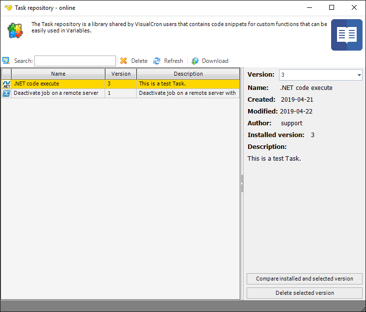

## Global - Task Repository

The Task repository is a shared Task library for the VisualCron community. The primary focus is on Tasks of type PowerShell and .NET Execute Tasks. The idea is that anyone can create a code snippet using any of these Task types and then share that code snipped (in Task) to the VisualCron community. After that, anyone in the community (depending on share settings) can access this Task and download locally.
 
The Task repository can be found in **Server tab->Global objects->Task** repository.
 
 
**Variables**

What makes Task repository even more useful is that you can execute these Task repository Tasks through Variables. In the Variables browser you can see all Task repository Tasks and send your own arguments. The Variable string itself can be used in any field within VisualCron.

**Task repository - main window**

**Add**

Opens the Add popup menu where you can select to add a Powershell or .NET Task for the repository.
 
**Edit**

Edits the Task in the selected row.
 
**Clone**

Clones the Task in the selected row.
 
**Delete**

Deletes the Task in the selected row.
 
**Import**

This creates a local Job with the selected Task. It is possible to click Import later to update an already existing Task with a another (maybe newer) local Task repository Task.
 
**Refresh**

Refreshes the list of local Task repository objects manually.
 
**Search**

Search field lets you filter the local Task repository on multiple columns.
 
**Clear filter**

Clears the existing search filter.
 
**Online repository**

Opens the community powered Online Task repoitory.
 
**Upload**

Uploads the selected local Task repository object to the Online repository. This can be done many times to update an existing object. Each time a new version is being created online and a diff can be made.

**Online Task repository**

**View**

Opens the Task repository Task for viewing
 
**Delete**

Deletes the selected Task repository object from the online repository. You can only delete your own objects.
 
**Refresh**

Reloads the online list of Task repository objects.
 
**Download**

Downloads the selected Task repository object to the local Task repository.

