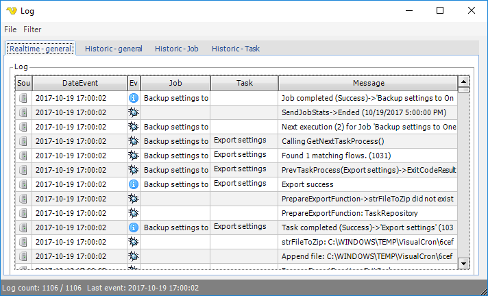

## Information - Log

In the main menu **Server > Information > Log** you can list events from the client and the server without saving and reading a log text file. By default, the server is sending all log events to the client. All the log window settings are controlled from the main menu **Server > Settings > Log settings** dialog.
 
**Server > Information > Log**

**Menu File > Export**

The log can be exported in Microsoft Excel format. Choose path, enter log file name and click on save.
 
**Menu Filter**

Filters are controlling what you see in the log window, not what is logged in the log files. The main filters control the log listing of log event types and are set by clicking on a specific filter in the Filters menu. When the icon is grayed out, the filter is active which means that the corresponding event type is not shown in the log listing.
 
In the Log area, the log listing is divided in a set of columns:

* *Source* - The origin of the event, either the server (a computer) or the client (a computer with a screen)
* *DateEvent* -The time when the event happened. Remember that the server time may differ from the client time if you are remotely connected
* *Event type* - An icon representing the event type which also corresponds to the one of the icons in the Filters menu
* *Job* - When a Job is connected to a certain event that Job name will be shown in this column
* *Task* - When a Task is connected to a certain event that Task name will be shown in this column
* *Message* - The verbose description of the event
 
**The Status bar**

The log window bottom status bar displays the number of shown log events / total log events and the when the last event was added to the log.