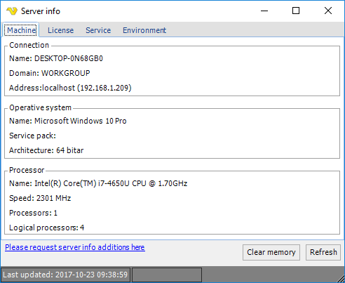
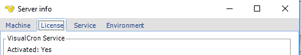

## Information - Server Info

The main menu **Server > Information > Server info** option shows some details related to the computer where the VisualCron server is installed, the current license status and information about the VisualCron server service.
 
**Server > Information > Server info > Machine** tab

**Server > Information > Server info > License** tab

