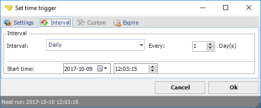

## Interval Time Triggers

**Set Time Trigger > Interval** tab

**Interval**

The Time unit (day, hour, minute, second or specific days of week/month) how often the Job should be triggered
 
**Every**

The occurrence ( 1:st, 2:nd, etc.) is set.
 
Whatever interval time unit that is selected, also the Start time (date and time for first run occurrence) may be selected.