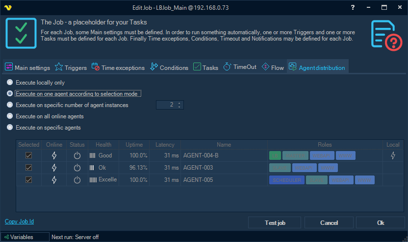

## Job - Agent Distribution

**Agent distribution** is a setting up of a certain Job so that execution of the Job can be performed not only on the local Server, but also on one or more Servers connected to the Broker Server.
In addition to this setting, you may need to specify in the Load balancer settings the method according to which Servers are selected for Job execution.

Distributed execution is configured on the "*Agent distribution*" tab in the Job editing form:

**Supported Job execution modes**

* *Execute locally only*

This is the default execution mode. The Job runs on the local Server only and no request is sent to the Broker.

* *Execute on one agent according to selection mode*

The Job execution request is sent to the Broker to whom the current Server is connected. The Broker determines on which of the connected Servers the Job should actually be executed, according to the selection mode configured in the Load balancer settings.

* *Execute on specific number of agent instances*

This mode is similar to the previous one, but the Broker selects a Server for Job execution (and sends the request) the specified number of times. The number of instances is set on the tab next to this option.

* *Execute on all online agents*

The Job execution request is sent to the Broker, which in turn sends a request to each of the connected Agents, taking into account additional filters configured on the Broker's side.

* *Execute on specific agents*

A list of Agents is selected on the tab. If the specified Agents include the current Server, the Job is forced to be executed locally first. Then a request is sent to the Broker for execution on the other specified Agents. Broker filtering is not applied to this mode, because the Agents are chosen explicitly.

**Agent selection and filtering**

For the modes that let the Broker pick the Agent (*Execute on one agent according to selection mode*, *Execute on specific number of agent instances* and *Execute on all online agents*), the selection method and the optional Agent filters are configured in the Load balancer settings, not on the Job.
 
See the [Load balancer - Execution Distribution](../servers/execution-distribution) topic for configuration information.
