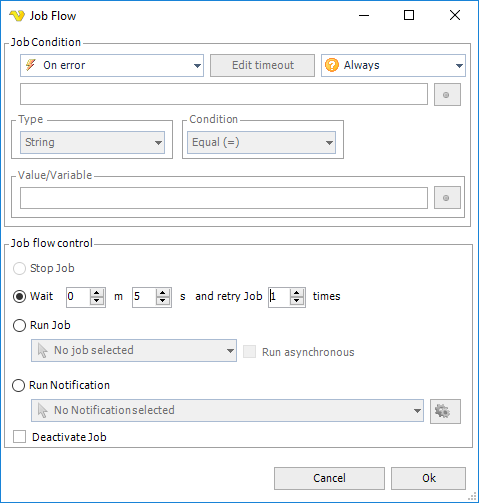

## Job - Flow

The Flow can be set both at Job and Task level, for Task level see [Task - Flow](task-flow) for more information.
 
### History

"Flow" was introduced from VisualCron version 7.0.0. Basically we took parts from **On error** handling, added specific **Condition** handling and then merged handling of Notifications in it. The goal was to make it easier to control flow of Job and Tasks and adding more basic Condition functionality.
 
### Job Flow

Job Flow has its own tab in the Job window. Job Flow adds controls what happens at different events:
* Job start
* Job complete
* Job fails
* Job success
* Job runs longer than
 
For example, upon failure you can choose to wait a couple of seconds and the retry the Job. Another thing you can do is to send you a Notification when the Job has failed. Besides the event you can add a condition that needs to be matched before continuing with the action in the flow.
 
**Add/Edit Job > Flow** tab

The list of "flows" are shown in the **Flow** tab. You can see the event, in this case "On error" and the action "Wait and retry Job". You can Add, Edit, Clone and Delete Flows in this tab.
 
If a new default flow is also desired for a previously defined Job, you need to click the _Get default flows_ icon for each Job flow you want the default flow for. For more information about Default flows, see [Server > Settings > Default flows](settings-default-flows).
 
**Add/Edit Job > Flow > Add/Edit** window

The Job Flow window are divided in two parts:
* Job Condition
* Job flow control  /action
 
### Job Condition

The Job Condition controls when and with what conditions the flow should be started.
 
**Event type**

* On start - performs the action at start (before Job is running)
* On error - performs the action when the Job has failed
* On success - performs the action when the Job returns success result
* On complete - performs the action when the Job completes - regardless of result
* On running longer than - performs the action if the Job runs longer than specified time
 
**On running longer than**

This option lets you control what happens if the Job run longer than a specified time. Click on the Edit timeout button to specify the time.
 
**Event condition**

Event conditions contains some basic conditions that are optionally evaluated when the event type is matched. If you do not want to use any conditions you set it to the "Always" which means that the flow will continue whenever the event has been raised.
* Always - will continue without evaluating any condition
* If other value/Variable - matches any two values - could be two Variables or a mix. Click the Variables icon to open the Variables list.
* If exit code - matches a value with the exit code of the Job
 
**Type/Condition**

When you have selected an event condition you decide how to match this condition - with what value and data type. As for the condition, you can select from Equal, Not equal, Contains and Not contains.
 
**Value/Variable**

Enter a value or click the Variables icon to open the Variables list.
 
### Task Flow control

The flow control group controls what happens when the Job Condition has been matched with event and condition.
 
**Wait and retry**

Waits a specified time and then try to run the Job again. You can choose how many times VisualCron will try to do this before stopping the Job completely.
 
**Run Job**

Runs another Job (asynchronous or synchronous).
 
**Run Notification**

Runs the specified Notification (this replaces previous Notifications).  Click the Settings icon to populate the drop-down list of existing Notifications.
 
**Deactivate Job**

Deactivates the current Job.