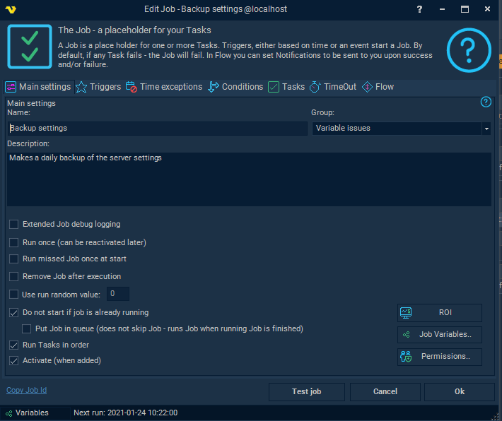
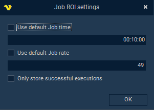
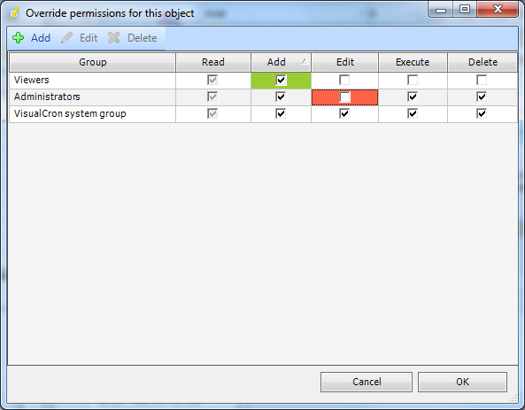

## Job - Main Settings

In the the _Add Job, Edit Job or Clone Job_ dialogs, the Main settings for a Job is available.
 
## Add Job

**Name**

Mandatory parameter, unique name for the Job.
 
**Group**

This is the visual grouping in the main window grid. To create a new group you just manually enter a value in this field.
 
**Description**

Add information to see the difference between Jobs.
 
**Extended Job debug logging**

When checked, VisualCron logs additional information during the execution - for example information about Triggers and all internal operations. This is mainly used for debugging if you experience a problem.
 
**Run once (can be activated later)**
 
**Run missed Jobs once at start**

This function can be used for a specific Job to let a Job automatically run if it should have been run during a time when the VisualCron service was down/stopped for any reason (typically due to server computer off). For example, a Job is supposed to run once a day at 08:00. Let's say that the server goes down at 07:00 because a power failure. The problem is corrected and the server goes up at 09:00. If the Run missed Jobs once at start box is checked, VisualCron will at startup check if the Job was supposed to run between the last time VisualCron was up and the current time. If so, that Job will be run **once**.
 
:::note Note 1 

Currently, run missed Jobs doesn't take time exceptions into account. A missed Job will run even if there was a time exception during that time.

::: 

:::note Note 2 

The "run missed events" behavior is not active when the server has been stopped by the user (i.e. server status "Off").

:::

**Remove Job after running**

If you check this box the Job will be removed right after running.
 
**Use run random value**

To be selected if you want to run Jobs at irregular time intervals. Check the box and enter a probability value. For example value 2 means that the Job will run approximately 1 out of 2 times. So if you want your Job to run approximately three times an hour, you should specify value 20 and in the Time settings select to run it every minute. 1 out of 20 times, the Job will run every minute (60/20 = 3 times in one hour). Note that this is a probability value. In this case, the Job may run 2 times one hour and 4 times another hour.
 
**Do not start if Job if is already running**

When a Job is running it is "flagged" as running. If you don't want to execute your Job while it's running the check this box. This can be useful when using the new events which can trigger your Job very often if you set the watch parameters "loosely". If the Job is triggered when this box is checked, a log entry will inform that the Job wasn't run due to this setting.
 
**Put Job in queue**

When checked: if a Job is already running the actual execution Job is postponed until the current Job has completed. This option should be enabled for any Jobs that is using Event Triggers which allows unique processing of an object, i.e. a newly created file when using File Trigger.
 
**Run Tasks in order**

One Job can contain many Tasks. If you for some reason want to run your Tasks in a special order, check this checkbox. The specific Task order is set up under the Tasks tab. If you don't want to run the Tasks in order, VisualCron will try to run them at the same time. This can shorten the actual run time for the Job since some Tasks are dependant on external factors like a remote server.
 
**Activate (when added)**

By default a new Job is activated (will be run if the time is right) when it's added.
 
**ROI**

These settings override the main ROI settings.

**Use default Job time**

When unchecked it will not use the main ROI settings but a specific time for this Job that is saved for each execution.
 
**Use default Job rate**

When unchecked it will not use main ROI settings rate per hour but a specific one for this Job.
 
**Only store succesful executions**

When checked it will only log ROI when the Job has succeeded.
 
**Job variables**

See [Job variables](jobvariables) for more information.
 
**Permissions..**

From VisualCron version 6.1.2, permissions for a specific Job can be set. It is controlled by overriding the current existing groups. When a specific permission is overridden in a positive way (granting access) it becomes green in the grid and it becomes red if overridden in a negative way (denying access).

