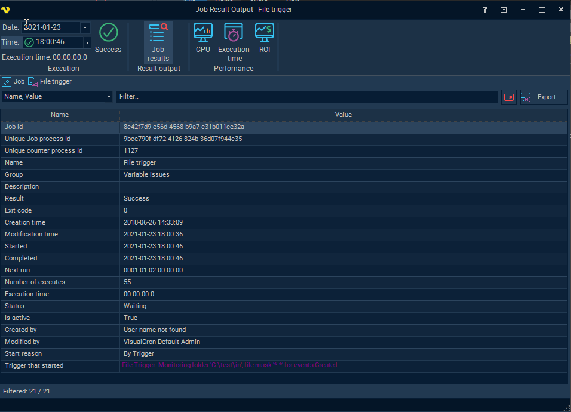
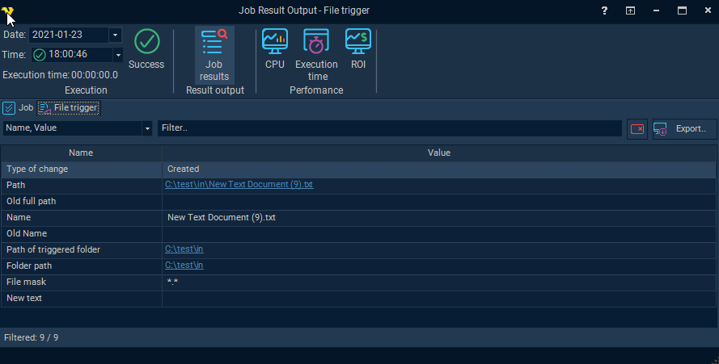
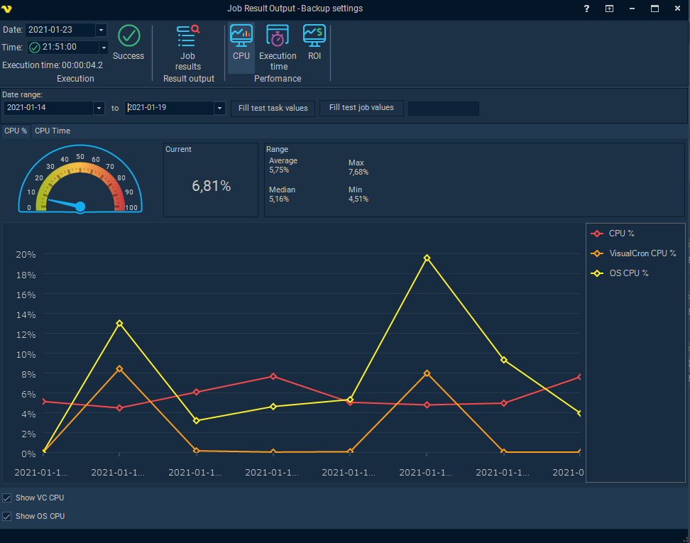
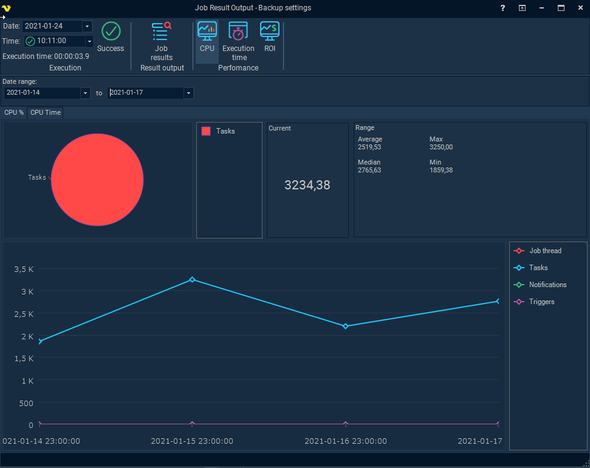
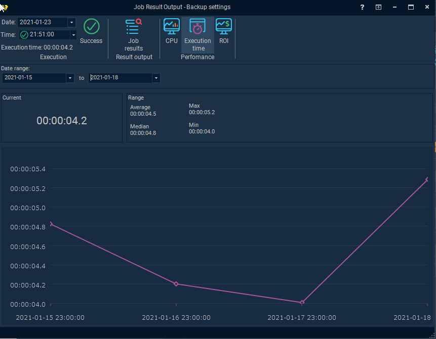
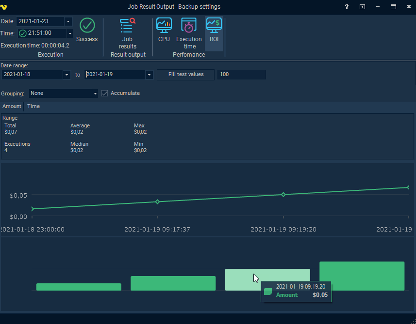

## Job - Result

The Job result window is similar to [Task output and result](taskoutputandresult) window but collects statistics and results for the whole Job.
 
### Accessing Job Result
 
You can access the Job result window the following ways;
* double click on the result (success/failure) icon in the Job row
* double click on the result (success/failure) text in the Job row
* right click on the Job->Result->Job result

### Execution

**Date of execution**

In the date picker you select which day you would like to view result from. The amount of data stored is determined by the database log settings in [server settings](serversettings). In the date picker you can see available dates where you have at least one execution. Whenever you select a date the available times the Task has been executed is listed in the Time selection box under.
 
**Execution time**

This is based on the Date of execution selection. In front of the time you see the result of the Task - if it was a success or failure.
 
**Time of execution**

This is the total time the Job ran.
 
**Success/Failure button**

Clicking this button show charts and statistics related to execution result.It is possible to control the range of executions. Success is marked in green and Failure in red. It is possible to zoom in and out in chart holding CTRL+Scroll wheel.
 
### Job results
 
Job results panel has at least one tab, "Job". This tab contains general information when, how and who started the Job among other things.
 
Depending on how it was started it might contain a Trigger tab. This will contain specific information about the Trigger, and what caused it to Trigger, at the moment of execution. Above you can see the File Trigger results tab. In that tab you can see, for example, which exact file caused the Trigger to trigger and in which folder it was created it. The information available depends on the Trigger type.
 
By right clicking on any row in Job results you can copy the underlying [Variable](variable) which might be interesting if you want to use it in a Notification or similar.

### Performance->CPU
 
The CPU chart displays the CPU usage for each execution. These are approximate values VisualCron calculate and log during execution to see the cost of the CPU usage during different operations. The information can be used to schedule Jobs and Tasks during different hours - to spread the CPU load.
 
There are two main views:
 
* CPU % - this is a % being used during the execution time period
* CPU Time - this is the cost value for the CPU during the execution time period
 
The CPU % usage is separted 4 categories:
 
* **Thread CPU **- how much CPU % is consumed by the Task internally in VisualCron
* **Process CPU** - how much CPU % is consumed by any process related to the Task. For example, the PowerShell Task uses an external process or execution.
* **VisualCron CPU** - how much CPU % consumed by VisualCron Server during that time. This way general usage can be compared  (can be optionally compared with checkbox)
* **OS CPU** - how much CPU % the operating system is using at that moment (can be optionally compared with checkbox)
 
The CPU time usage is separated into 2 categories:
 
* **Thread CPU** - how much CPU time is consumed by the Task internally in VisualCron
* **Process CPU** - how much CPU time is consumed by any process related to the Task. For example, the PowerShell Task uses an external process or execution.
 
There is a chart showing the latest value which is based on the selection Date + Time in the top left window. The data range defines the period being used for the line chart and the range values - this is controlled by the date range controls. It is possible to zoom with the mouse wheel and mark certain areas.

In the Job result->Performance CPU->CPU time you can see how much the CPU spent on Job, Task, Trigger and Notification. In general the footprint is low in VisualCron and you would see most work in the Task.
 
### Performance->Execution time
 
The Execution time is how long it takes for a Job to complete. This is affected by the CPU load and the amount of data being processed and the delay in any external service. The charts help VisualCron users to get an overview, over time, how long time it takes for a specific operation.
 
The date range controls the line chart and range values. The current value is controlled by the selected Date + Time in the top left window.

### Performance->ROI
 
The stats in the ROI tab shows how much each execution of a Job, during a period, saved the company.

