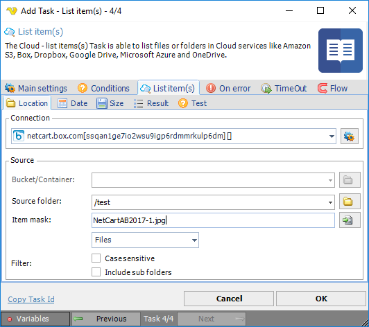
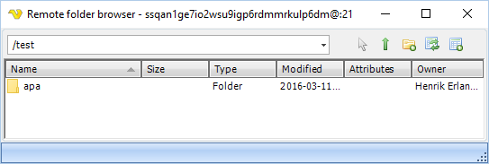
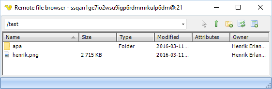
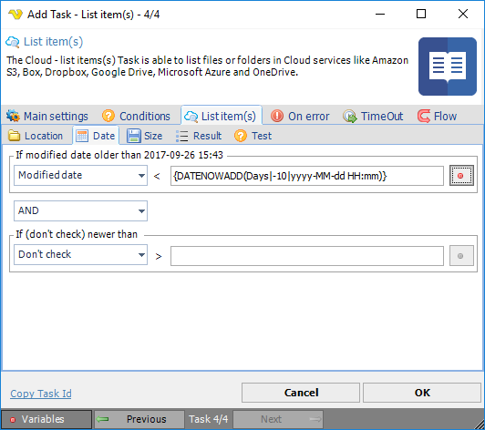
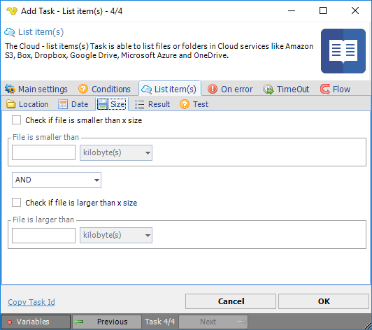
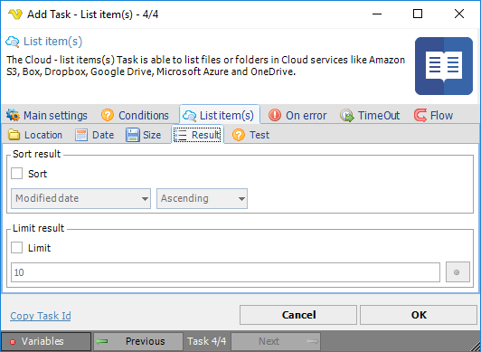
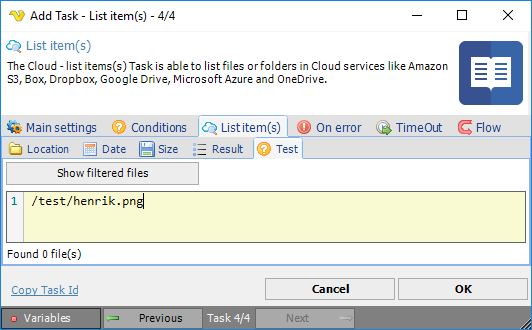

## Cloud Remote File Filter

In order to simplify and unify common parameters, the standard VisualCron Cloud remote filter is used in the below list of Cloud Tasks:

* [List item(s)](../server/job-tasks/cloud-transfer-tasks/list-item)
* [Download file(s)](../server/job-tasks/cloud-transfer-tasks/download-file)
* [Delete item(s)](../server/job-tasks/cloud-transfer-tasks/delete-item)
 
**Location** sub tab

**Connection**

To use a specific cloud service you need to create a [Connection](../server/global-connections) first. Click the *Settings* icon to open the *Manage Connections* dialog.
 
**Bucket/Container**

This property is used for Amazon Cloud services to specify the Bucket.
 
**Source folder**

This is the remote source folder. Click the *Folder* icon to select the folder.

**Item mask**

The file/folder mask. Use wild cards like * and ?. Click the *File* icon to select the file.

**Filter**

Select whether you want to get Files, Folders or All.
 
**Case sensitive**

Check if you want a case sensitive match.
 
**Include sub folders**

Check if you want to include sub folders and not just the base *Source folder*.
 
**Date** sub tab

**Modified date**

Use a Variable to, for example, download files older than a specific modified date.
 
**Created date**

Use a Variable to, for example, download files older than a specific modified date.
 
**Size** sub tab

**Check if file is smaller than x size**

Filter files that are smaller than a value/Variable.
 
**Check if file is larger than x size**

Filter files that are larger than a value/Variable.
 
**Result** sub tab

**Sort**

By checking sort you can sort the found files according to your desired order. This is important if you later want to limit the result to, for example, the 10 newest files.
 
**Limit**

How many files you want to return.
 
**Test** sub tab

The Test tab lets you test the result of your set filters to see what is really returned.