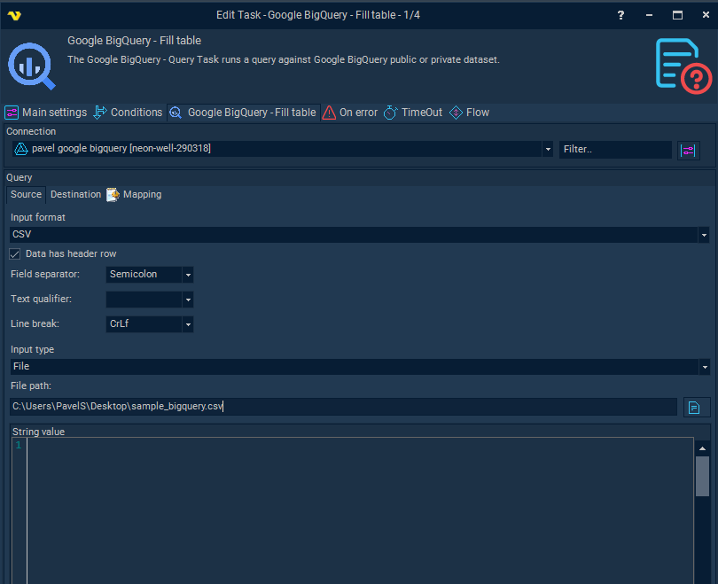
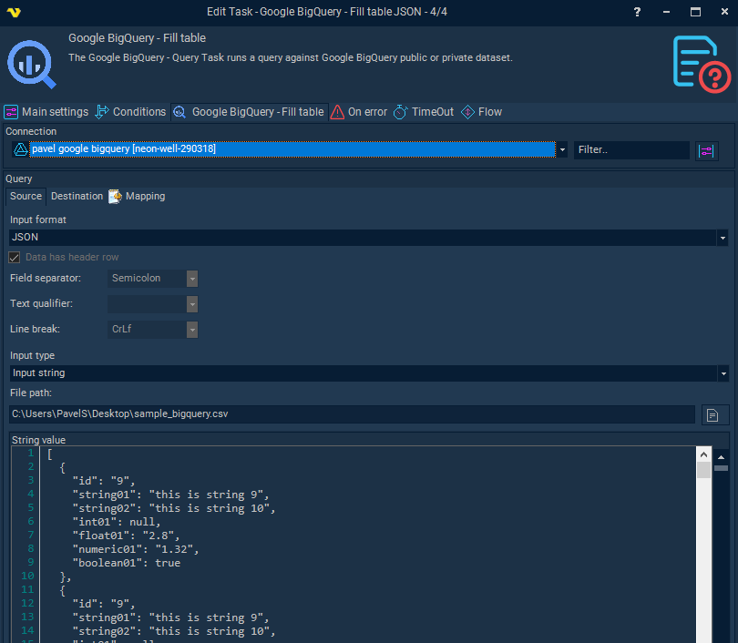

## Task Database - BigQuery - Fill Table

The Google BigQuery - Fill Task loads data into Google BigQuery private dataset table.
 
The BigQuery Tasks require the [Google Cloud Connection](connection-google-cloud).

**Input format**

Can be CSV or JSON. When CSV is selected - CSV related settings can be updated:
 
**Data has header row**

Checking this one means that first line contains header row, and column named mapping can be used when running this task. Otherwise positional mapping would be applied.
 
**Field separator**

describes character that separates one field from another within one line;
 
**Text qualifier**

Text quotation setting (if set in input data). Character mentioned here will be removed from TEXT fields start and ending.
 
**Line break**

describes symbol(s) that are used for line breaking when parsing.
 
**When input format is JSON**

Valid JSON array of JSON objects is expected on input, column mapping will be done via JSON object property names.

**Input type**

File or String Data. When input type is file - file path needs to be specified.
Otherwise String value will be used as input. Both of these fields support Variables.